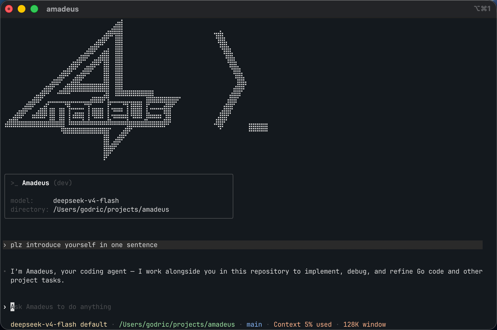

<p align="center">
  
</p>

# Amadeus

Amadeus is a terminal coding agent written in Go. It supports Tool calling, MCP, Skills, `AGENTS.md`, resumable sessions, approvals, Plan mode, and basic Multi-Agent delegation.

## Features

- Tool calling for file reading, search, editing, command execution, and image inspection.
- MCP servers over stdio and Streamable HTTP.
- User and project Skills with progressive resource loading.
- Hierarchical `AGENTS.md` instructions.
- Resumable sessions, approvals, Default and Plan modes.
- Persisted Thread Goals with automatic continuation across physical turns.
- Basic Multi-Agent delegation with read-only explorer SubAgents.

<p align="center">
  
</p>

## Quick Start

Amadeus currently requires Go 1.26 or later.

```bash
git clone https://github.com/Godric-W/Amadeus.git
cd Amadeus

make build
```

The binary is written to:

```text
bin/amadeus
```

For a normal user installation, place the binary on your `PATH`:

```bash
mkdir -p "$HOME/.local/bin"
install -m 0755 bin/amadeus "$HOME/.local/bin/amadeus"
```

### Configure `AMADEUS_HOME`

`AMADEUS_HOME` is the directory used for Amadeus configuration, user Skills, MCP configuration, and local session data.

Setting it explicitly is recommended:

```bash
export AMADEUS_HOME="$HOME/.amadeus"
mkdir -p "$AMADEUS_HOME"
```

If `AMADEUS_HOME` is not set, Amadeus uses the resolved directory containing the executable. For example, running the repository binary directly makes `bin/` the Amadeus home. This is useful for local development, but an explicit user directory is more predictable for regular use.

A typical home directory looks like this:

```text
$AMADEUS_HOME/
├── config.yaml
├── AGENTS.md
├── mcp.yaml
├── skills.yaml
├── skills/
│   └── review/
│       ├── SKILL.md
│       ├── references/
│       ├── scripts/
│       └── assets/
├── sessions/
│   └── YYYY/MM/DD/*.jsonl
└── data/
    ├── state_1.sqlite
    └── goals_1.sqlite
```

Files and directories are created as needed. Audit logs use the platform state directory instead of `AMADEUS_HOME`:

```text
$XDG_STATE_HOME/amadeus/audit/audit.jsonl
```

If `XDG_STATE_HOME` is unset, the default is `~/.local/state/amadeus/audit/audit.jsonl`.

### Create `config.yaml`

Copy the repository example:

```bash
cp configs/config.yaml.example "$AMADEUS_HOME/config.yaml"
```

Then configure a model and provider. A minimal OpenAI configuration is:

```yaml
model: gpt-5
model_provider: openai
model_context_window: 400000
model_input_modalities: [text]
model_supports_original_image_detail: false
tool_output_token_limit: 10000

model_providers:
    openai:
        wire_api: responses
        dialect: openai
        api_key: ""
        base_url: https://api.openai.com/v1
        timeout: 120s
        request_max_retries: 4
        stream_max_retries: 5
        stream_idle_timeout: 5m

agent:
    max_parallel_tools: 4
    multi_agent:
        enabled: true
        max_agents: 4
        max_depth: 1
        child_max_samples: 20
        child_max_tool_calls: 100
        child_max_duration: 15m

logging:
    level: info
    trace_llm: false
```

Keep API keys out of the file when possible:

```bash
export AMADEUS_API_KEY="your-api-key"
```

The selected provider is an alias under `model_providers`. Amadeus also supports OpenAI-compatible providers through `wire_api: chat_completions` and `dialect: standard`, plus provider dialects for OpenAI, DeepSeek, Qwen, and GLM.

Validate and inspect the effective configuration:

```bash
amadeus config check
amadeus config show
amadeus config explain
```

Use `--config <path>` to select a main configuration file without changing `AMADEUS_HOME`:

```bash
amadeus --config ./config.yaml config check
```

The complete configuration template is available at [`configs/config.yaml.example`](configs/config.yaml.example).

### Start Amadeus

Start the interactive TUI in the current directory:

```bash
amadeus
```

Start the TUI and automatically submit an initial prompt:

```bash
amadeus "Inspect the current changes, fix the failing tests, and verify the result"
```

The TUI remains open after the initial turn. Amadeus currently has no headless or stdin task mode.

Use another directory as the working root:

```bash
amadeus -C /path/to/project
amadeus --cd /path/to/project "Run the test suite"
```

Add extra writable directories without changing the primary working root:

```bash
amadeus \
  --cd /workspace/backend \
  --add-dir /workspace/frontend \
  --add-dir ../shared \
  "Update the API and its clients"
```

Continue or resume a session:

```bash
amadeus --continue
amadeus --resume
amadeus --resume <session-id>
amadeus --resume=<session-id> "Continue the remaining work"
```

`--continue` and `--resume` cannot be used together. Running `--resume` without an ID opens the session picker and requires an interactive terminal.

## CLI Options

Command form:

```text
amadeus [PROMPT] [flags]
```

| Option                                   | Description                                                                                              |
| ---------------------------------------- | -------------------------------------------------------------------------------------------------------- |
| `[PROMPT]`                               | Optional initial TUI prompt. At most one positional prompt is accepted.                                  |
| `-C, --cd <dir>`                         | Use the specified directory as the working root. Relative paths are resolved from the startup directory. |
| `--add-dir <dir>`                        | Add another writable directory. May be repeated.                                                         |
| `--continue`                             | Continue the most recently updated session for the current working root.                                 |
| `--resume[=<session-id>]`                | Resume a session by ID, or open the session picker when no ID is supplied.                               |
| `--config <path>`                        | Load the main configuration from an explicit path.                                                       |
| `--model-provider <name>`                | Override the selected provider alias.                                                                    |
| `--model <name>`                         | Override the model name.                                                                                 |
| `--model-reasoning-effort <effort>`      | Set `none`, `minimal`, `low`, `medium`, `high`, `xhigh`, or `max`.                                       |
| `--model-input-modalities <values>`      | Override model inputs, for example `text` or `text,image`.                                               |
| `--model-supports-original-image-detail` | Expose original image detail for a model that supports it.                                               |
| `--wire-api <api>`                       | Override the wire API: `responses` or `chat_completions`.                                                |
| `--dialect <dialect>`                    | Override the provider dialect: `standard`, `openai`, `deepseek`, `qwen`, or `glm`.                       |
| `--base-url <url>`                       | Override the selected provider base URL.                                                                 |
| `-h, --help`                             | Show command help.                                                                                       |

Useful environment overrides include:

| Environment variable                           | Purpose                                          |
| ---------------------------------------------- | ------------------------------------------------ |
| `AMADEUS_HOME`                                 | Configuration and session data directory.        |
| `AMADEUS_API_KEY`                              | API key for the selected provider.               |
| `AMADEUS_MODEL_PROVIDER`                       | Provider alias from `model_providers`.           |
| `AMADEUS_MODEL`                                | Model name.                                      |
| `AMADEUS_BASE_URL`                             | Provider base URL.                               |
| `AMADEUS_WIRE_API`                             | `responses` or `chat_completions`.               |
| `AMADEUS_DIALECT`                              | Provider dialect.                                |
| `AMADEUS_MODEL_REASONING_EFFORT`               | Model reasoning effort.                          |
| `AMADEUS_MODEL_INPUT_MODALITIES`               | Comma-separated model input modalities.          |
| `AMADEUS_MODEL_SUPPORTS_ORIGINAL_IMAGE_DETAIL` | Enable or disable original image detail support. |

Run `amadeus --help` for the authoritative option list.

## CLI Subcommands

Amadeus also provides non-interactive commands for inspecting the local setup:

| Command                      | Description                                                                         |
| ---------------------------- | ----------------------------------------------------------------------------------- |
| `amadeus config check`       | Load and validate the effective configuration.                                      |
| `amadeus config show`        | Print the effective configuration with secrets redacted.                            |
| `amadeus config explain`     | Print the effective configuration and the source of each field.                     |
| `amadeus sessions list`      | List sessions associated with the current working root.                             |
| `amadeus tools list`         | List the target built-in Tool surface, exposure, conditions, and side effects.      |
| `amadeus web check`          | Check enabled web configuration, authentication, connectivity, and response format. |
| `amadeus version`            | Print version and build metadata.                                                   |
| `amadeus completion <shell>` | Generate completion scripts for `bash`, `zsh`, `fish`, or `powershell`.             |

`amadeus web check` accepts `--query <text>` for the search probe and `--url <url>` to exercise web fetch. Global configuration and working-directory flags can also be used with these subcommands.

## Slash Commands

Slash Commands are available in the interactive TUI. Type `/` to open the command list.

| Command                | Description                                                                                    |
| ---------------------- | ---------------------------------------------------------------------------------------------- |
| `/resume [session-id]` | Resume a saved session or open the session picker.                                             |
| `/skills`              | List Skills or enable and disable them.                                                        |
| `/rename [name]`       | Rename the current session. Without a name, opens an input dialog.                             |
| `/delete`              | Permanently delete the current session and exit.                                               |
| `/compact`             | Compact the current conversation context.                                                      |
| `/plan [task]`         | Enter Plan mode. With a task, submits it after changing mode.                                  |
| `/goal [objective]`    | Create or view a long-running Goal; also supports `clear`, `edit`, `pause`, and `resume`.     |
| `/copy`                | Copy the latest agent Markdown response.                                                       |
| `/status`              | Show session, model, reasoning, permission, token, and Prompt provenance/revision diagnostics. |
| `/mcp`                 | Show configured MCP servers, tools, and resource counts.                                       |
| `/mcp verbose`         | Show the detailed MCP inventory.                                                               |
| `/clear`               | Clear the UI and start a new session.                                                          |
| `/exit`                | Shut down the current session and exit.                                                        |

`/compact` creates a durable context checkpoint while preserving the original rollout. Automatic compaction uses the same checkpoint lifecycle when the active model context reaches its configured limit. A `~` before the statusline context percentage marks a local preflight estimate; provider-reported request usage replaces that estimate after a successful response.

### Goals

Goals belong to a saved Thread and let Amadeus continue a long-running objective across multiple ordinary turns. Use `/goal <objective>` to create a Goal; the command is echoed once in the TUI, then Amadeus starts an automatic continuation when the Thread becomes idle. Each continuation is a normal model turn with its own progress and terminal state.

Use `/goal` to view the current objective, elapsed time, token usage, and budget. `/goal edit` changes the objective while preserving accumulated usage, `/goal pause` stops automatic continuation, `/goal resume` resumes a paused, blocked, or usage-limited Goal, and `/goal clear` removes it. The footer reports states such as `Pursuing goal (3h 21m)` and `Goal achieved (3h 21m)`. Goal controls require a persistent Thread; Plan mode and read-only explorer SubAgents do not run automatic Goal work.

Goals are enabled by default. You can disable them or set a maximum and default token budget in `config.yaml`:

```yaml
features:
    goals: true

goals:
    max_goal_token_budget: 100000
```

`/resume`, `/skills`, `/copy`, `/status`, `/mcp`, and `/exit` remain available while a task is running. Skill enable/disable changes are unavailable until the task becomes idle. Use `Shift+Tab` to switch between Default and Plan modes while idle.

While a turn is running, press `Enter` to send ordinary text into the current turn or `Tab` to queue it for a new turn. When the composer contains a queueable draft, the footer shows `tab to queue message` (or `tab to queue` at narrow widths) instead of the passive statusline. Queued messages are submitted one at a time in FIFO order after each turn completes. They remain local to the active TUI attachment until submitted; interrupted or budget-blocked turns restore them to the composer instead of sending them automatically.

## AGENTS.md

`AGENTS.md` provides persistent instructions for how Amadeus should work.

Amadeus loads:

```text
$AMADEUS_HOME/AGENTS.md
<working-root>/AGENTS.md
<working-root>/path/to/current/AGENTS.md
```

The user-level file is loaded first. Project files are loaded from the working root toward directories that Amadeus reads, edits, or uses as command working directories. This allows broad repository guidance at the root and more specific guidance in subdirectories.

Example:

```markdown
# Repository Instructions

- Run `go test ./...` after changing Go code.
- Use `gofmt` on modified files.
- Do not edit generated files manually.
- Keep public APIs backwards compatible.
```

Rules:

- Files must be regular, non-empty UTF-8 text files.
- The combined instruction budget is 64 KiB.
- Instructions are refreshed as Amadeus works in new directories.
- File-changing and command tools reject stale instruction snapshots instead of executing against changed guidance.
- `--add-dir` roots may contain their own applicable `AGENTS.md` files.

## Skills

A Skill is a directory containing a `SKILL.md` file and optional supporting resources.

Amadeus scans:

```text
$AMADEUS_HOME/skills/<skill-name>/SKILL.md
<working-root>/.amadeus/skills/<skill-name>/SKILL.md
```

Project Skills replace user Skills with the same frontmatter `name`.

Recommended layout:

```text
.amadeus/skills/review/
├── SKILL.md
├── references/
│   └── checklist.md
├── scripts/
│   └── check.sh
└── assets/
    └── report-template.md
```

Minimal `SKILL.md`:

```markdown
---
name: review
description: Review changed code and report focused correctness risks
short_description: Review code changes
allow_implicit_invocation: true
---

# Review Workflow

1. Inspect the relevant diff and surrounding code.
2. Prioritize correctness, regressions, and missing tests.
3. Report findings with concrete paths and evidence.
```

Skill names use lowercase letters, digits, and hyphens. `description` and a non-empty body are required. `short_description` and `allow_implicit_invocation` are optional.

The model initially receives a Skill metadata index, not every Skill body and resource. It can load the body or files under `references/` as needed. Scripts are not executed automatically; project Skill scripts run only through the normal command tool and approval flow. User-level Skill scripts are treated as reference material under the current security policy.

Invoke a Skill explicitly with `$<name>`:

```bash
amadeus '$review inspect the current changes'
```

Enable or disable Skills through `/skills`. Disabled names are stored in:

```text
$AMADEUS_HOME/skills.yaml
<working-root>/.amadeus/skills.yaml
```

Example:

```yaml
disabled:
    - review
    - release-check
```

See [`configs/skills/review/SKILL.md`](configs/skills/review/SKILL.md) for a repository example.

## MCP

MCP servers are configured separately from the main `config.yaml`.

Amadeus loads:

```text
$AMADEUS_HOME/mcp.yaml
<working-root>/.amadeus/mcp.yaml
```

User and project servers are merged by name. A project server replaces the complete user server definition with the same name.

### Stdio server

```yaml
servers:
    local-tools:
        transport: stdio
        command: /absolute/path/to/mcp-server
        args: ["--mode", "stdio"]
        env:
            SERVICE_TOKEN: ${SERVICE_TOKEN}
        timeout: 30s
        enabled: true
```

### Streamable HTTP server

```yaml
servers:
    remote-tools:
        transport: streamable_http
        url: https://mcp.example.com/mcp
        headers:
            Authorization: Bearer ${MCP_AUTH_TOKEN}
        timeout: 30s
        enabled: true
```

MCP rules:

- Server names may contain letters, digits, `-`, and `_`.
- `enabled` defaults to `true` when omitted.
- `${VARIABLE}` values are expanded from the environment when the file is loaded.
- A missing referenced environment variable is a configuration error.
- Stdio servers use `command`, `args`, and `env`.
- Streamable HTTP servers use `url` and `headers`.
- YAML fields are validated strictly.
- Connections, tool catalogs, and resource catalogs are loaded on demand.
- Read-only MCP tools can run directly; other MCP tool calls use the normal approval flow.

Inspect MCP configuration in the TUI with `/mcp` or `/mcp verbose`.

See [`configs/mcp.example.yaml`](configs/mcp.example.yaml) for a complete example.

## SubAgents

Amadeus includes basic Codex-style delegation. The root agent can create read-only explorer SubAgents for independent investigations and continue working while they run.

Configure delegation in `config.yaml`:

```yaml
agent:
    max_parallel_tools: 4
    multi_agent:
        enabled: true
        max_agents: 4
        max_depth: 1
        child_max_samples: 20
        child_max_tool_calls: 100
        child_max_duration: 15m
```

Current SubAgent behavior:

- Only direct children of the root agent are supported.
- SubAgents use the same working root but have independent conversations and tool state.
- SubAgents are read-only explorers.
- They can use `read`, `glob`, `grep`, and conditionally available read-only capabilities such as `read_skill` and `web_search`.
- They cannot edit files, execute commands, request user input, call MCP tools, or create additional SubAgents.
- The root agent manages them through `spawn_agent`, `send_input`, `wait_agent`, and `close_agent`.
- A successfully spawned SubAgent belongs to the root thread tree and keeps running when the root's current turn ends.
- `wait_agent` returns when any target reaches a final status; blocked outcomes retain their actual reason instead of being reported as successful output.
- Near its safety budget, a SubAgent gets one no-tools finalization request so it can return the best verified report.
- Saved open child work is restored with its root session when needed. Explicitly closed children remain closed and do not consume slots after resume.
- Codex Multi-Agent V2, mailbox/residency, history forks, write workers, child interaction, teams/worktrees/remote agents, and a full agent picker are intentionally out of scope.

Delegation is most useful for bounded tasks such as locating an implementation, comparing independent modules, or gathering evidence while the root agent handles the critical path.

## Optional Web and Image Tools

Web tools are disabled by default. Enable them in `config.yaml`:

```yaml
web:
    search:
        enabled: true
        provider: duckduckgo
        timeout: 15s
        max_results: 5
    fetch:
        enabled: true
        timeout: 30s
        max_bytes: 1048576
        max_redirects: 3
```

Supported search providers are DuckDuckGo, Tavily, SearXNG, and Brave. DuckDuckGo does not require an API key. Web fetch requests may require approval for new hostnames.

To expose `view_image`, declare image input support for the selected model:

```yaml
model_input_modalities: [text, image]
model_supports_original_image_detail: false
```

Amadeus supports PNG, JPEG, WebP, and static GIF input with bounded image preparation.

## Development

```bash
make check
go test -race ./... -count=1
```
