# Amadeus 架构白皮书

> 文档日期：2026-08-24
> 适用版本：当前 `main` 分支基础能力、Basic Multi-Agent 与 Next-Turn Queue 实现
> 规范来源：`docs/design.md` 是主要 Contract 工作文档；本文负责解释架构、所有权、运行流程与核心数据模型。两份文档都可能过期，遇到不确定处必须回查 Codex/Claude Code 源码并同步修正。

## 1. 文档目的

Amadeus 是一个使用 Go 实现的终端 Coding Agent。它不是简单的“模型请求 + Tool 回调”程序，而是一个具有以下性质的长期运行系统：

- Thread、Session、Turn 和 Tool Call 都有明确身份与生命周期。
- 用户输入、模型流、Tool 执行、Approval、持久化和 TUI 通过 typed protocol 协作。
- JSONL Rollout 保存完整 canonical history；SQLite 只保存可重建的 Thread metadata index。
- Prompt、Context、ToolRouter 和 Provider Request 在每次模型采样时形成一致快照。
- MCP、Skill、Web、图片和 Multi-Agent 都进入同一 Session/Tool/Event 主链，不建立第二套 Agent Runtime。
- Root Agent 可以创建由 Amadeus 自己驱动的只读 explorer SubAgent；SubAgent 本身仍是完整 Thread/Session。
- Fullscreen TUI 将 Enter same-turn steer 与 Tab next-turn queue 分开；未提交 queue state 不进入 Runtime 或 canonical persistence。

本文面向以下读者：

- 希望理解 Amadeus 全局架构和运行流程的开发者。
- 需要修改 Runtime、Tool、Context、Persistence 或 TUI 的维护者。
- 需要新增 Provider、Tool、Capability 或 Agent 类型的扩展开发者。

### 1.1 数据模型范围

本文中的“数据模型”指生产主链上具有独立架构职责的模型，包括：

- 跨 package 传递的 DTO、协议 envelope 和 durable item。
- 拥有并发状态、资源或生命周期的 runtime object。
- 决定权限、可见性、持久化或 UI 投影的 read model。

纯测试 fixture、只为 JSON 参数解码存在的私有小结构、普通 error wrapper 和无独立职责的 helper 不逐一列出；它们归属于文中对应 owner。

## 2. 核心架构原则

1. **唯一 Runtime 主链**：Root Agent、Plan Mode、Compaction 和 SubAgent 都复用 Session、Task、`run_turn`、ToolExecutionService 与 Rollout。
2. **唯一事实 owner**：ThreadManager 管 live Thread；Session 管 active Turn；`context.Manager` 管模型上下文；ToolRouter 管单次采样工具集合；MCPRuntime 管 MCP 连接；AgentControl 管 root agent tree control plane。
3. **Protocol first**：跨 goroutine、跨层和需要恢复的事实使用 typed `Submission`、`EventMsg`、`TurnItem` 或 `RolloutItem` 表达。
4. **Canonical persistence**：JSONL Rollout 是完整历史事实源；SQLite 不保存第二份对话历史。
5. **Prompt 与能力一致**：模型看到的 ToolSpec、Prompt guidance 和实际 dispatch 必须来自同一个 StepContext/ToolRouter snapshot。
6. **Approval 不等于权限文本**：Approval 是运行时决策协议；文件系统策略和 Session Grant 是独立的强制边界。
7. **UI 只做 projection**：TUI 不成为 Thread、Agent、Approval 或 Tool 状态的事实 owner。
8. **取消树明确**：Root shutdown、Session shutdown、Turn interrupt、Tool cancellation 和 Process cancellation都有明确父子关系。

## 3. 总体分层架构

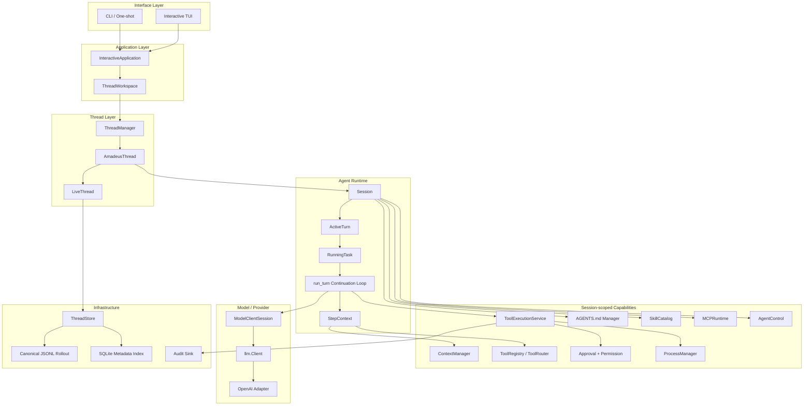

### 3.1 六层职责

| 层 | 主要 package | 职责 | 不拥有的内容 |
|---|---|---|---|
| Interface | `cmd/amadeus`、`internal/interface/*` | 参数、终端输入、TUI 渲染、Approval 交互 | Session 状态、Thread map、Tool truth |
| Application | `internal/app` | 当前 Thread 选择、UI generation、事件泵、Slash Command 应用生命周期 | Provider、Rollout writer、Tool executor |
| Thread | `internal/thread/*` | Thread identity、live registry、writer、Resume、metadata 操作 | Active Turn、模型循环 |
| Agent Runtime | `internal/agent/*` | Session loop、Turn、Task、Step、模型 continuation、Multi-Agent control | SQLite 实现、TUI cell |
| Capabilities | `internal/context`、`tool`、`policy`、`mcp`、`skill` 等 | Prompt/context、工具、权限、外部能力 | 顶层 Thread 生命周期 |
| Infrastructure | `internal/state`、`thread/local`、`audit`、Provider adapter | JSONL、SQLite、日志、网络与进程适配 | 产品级运行状态决策 |

## 4. 所有权与生命周期

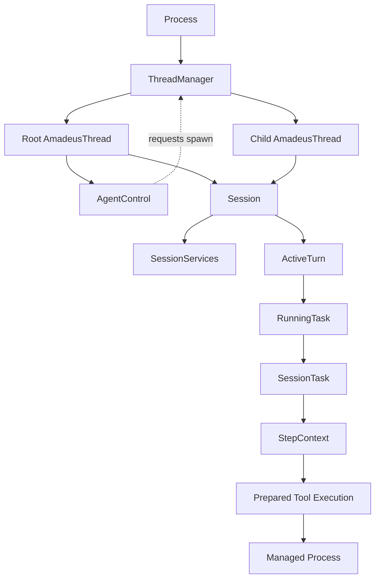

### 4.1 生命周期规则

- `ThreadManager` 是进程内 live `AmadeusThread` 的唯一 registry。
- 一个 `AmadeusThread` 包装一个 `Session`、一个 `SessionIo` 和一个 `LiveThread`。
- 一个 `Session` 同时最多拥有一个 `ActiveTurn`，但可以保存 deferred submissions 和 same-turn pending input。
- 一个 `ActiveTurn` 拥有一个 `RunningTask`、一个 `TurnState` 和当前 `TaskOutput`。
- 一个 `RunningTask` 拥有 cancellation context，并执行一个 `SessionTask`。
- 一个 `SessionServices` 在 Session 生命周期内复用 Provider client、Context、Tool、Approval、MCP、Skill、Process 和 Compactor。
- 一个 `StepContext` 只对应一次模型采样及其紧随的 Tool dispatch；下一次采样必须重新捕获。
- `AgentControl` 只由 Root Thread 拥有；child 共享引用但不能关闭它。
- `NextTurnQueue` 由 Bubble Tea `fullscreenModel` 串行拥有，按 active Thread attachment 隔离；它不是 Session deferred submission 或 TurnInputQueue。

## 5. Canonical Turn 数据流

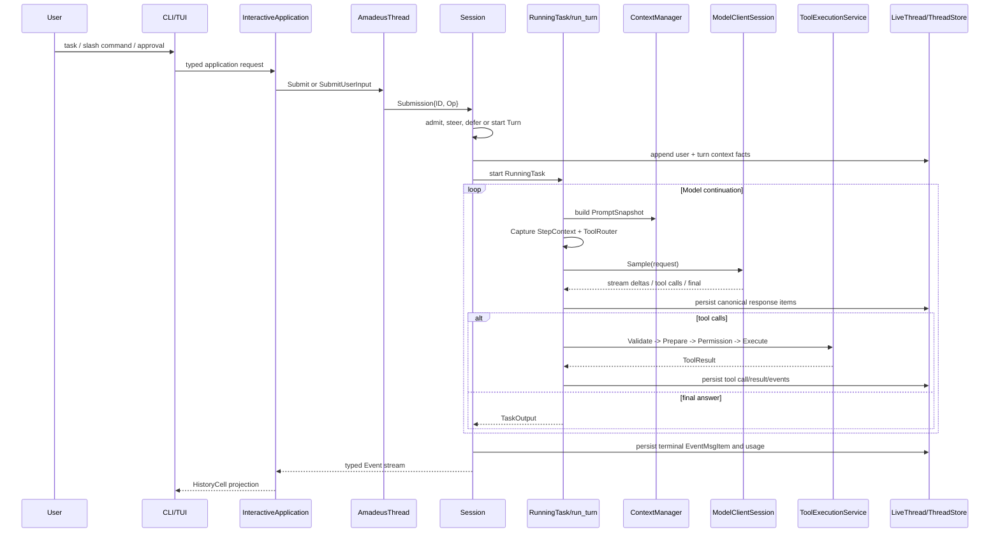

### 5.1 核心数据流模型

| 模型 | 所属 package | 职责 |
|---|---|---|
| `SessionID` | `agent/protocol/identity` | Root 与全部 child Thread 共享的 agent-tree/session-level UUID identity。 |
| `ThreadID` | `agent/protocol/identity` | 一个具体 Thread、Rollout、Event scope 和 Resume target 的 UUID identity；Amadeus 新建值为 UUIDv7。 |
| `TurnID` | `agent/protocol/identity` | Session 内一次 regular/compact Turn 的身份。 |
| `SubmissionID` | `agent/protocol/identity` | 将输入操作与输出 Event 关联起来。 |
| `RequestID` | `agent/protocol/identity` | Approval 或 `request_user_input` waiter 的身份。 |
| `ItemID` | `agent/protocol/identity` | Assistant、Reasoning、Tool、Plan、Collaboration item 的稳定身份。 |
| `Submission` | `agent/protocol` | 输入 envelope，由 `ID + Op` 组成，进入 Session loop。 |
| `Event` | `agent/protocol` | 输出 envelope，由关联 `ID + EventMsg` 组成，离开 Session loop。 |
| `RolloutItem` | `rollout` | JSONL canonical history 的 tagged domain item。 |
| `TurnItem` | `agent/protocol` | live/Resume/Inline 共用的稳定 UI replay unit。 |
| `PromptSnapshot` | `context` | 一次模型请求看到的消息、usage、history revision 和 world-state revision。 |
| `StepContext` | `agent/engine` | 一次模型采样的不可变能力快照，绑定 Prompt、Model、ToolRouter 和 revisions。 |
| `NextTurnQueue` | `interface/tui` | 尚未提交的下一 Turn 输入 FIFO 与 InFlight gate；terminal 后才通过普通 UserInputOp 启动新 Turn。 |

## 6. 配置与 Composition Root

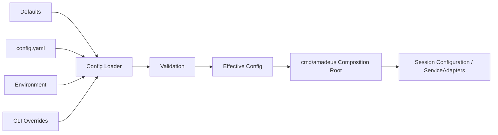

### 6.1 模块职责

- `cmd/amadeus` 解析进程级参数，确定 `AMADEUS_HOME`、项目目录、附加目录、Provider、Model 和运行模式。
- `internal/config` 负责默认值、文件加载、环境变量、CLI patch、provenance、脱敏和验证。
- 用户配置采用唯一 versionless strict schema；Loader 通过 KnownFields 拒绝 `version:` 和其他删除字段，不运行 schema migration。仓库模板为 `configs/config.yaml.example`，自动发现文件仍只有 `$AMADEUS_HOME/config.yaml`。
- Composition Root 创建 ThreadStore、Provider adapter factory、Audit factory、Web/MCP dependencies 和 `ThreadManager`。
- 配置进入 Session 前被克隆和冻结；Turn 再从 Session Configuration 派生稳定 `TurnContext`。

### 6.2 数据模型职责

| 模型 | 职责 |
|---|---|
| `config.Config` | 当前进程有效配置总聚合；包含模型、Provider、Agent、Web 和 Logging。 |
| `ModelProviderInfo` | 一个用户命名 Provider alias 的 transport 配置：Wire API、Dialect、Base URL、API Key、retry/timeout。 |
| `WireAPI` | 区分 `responses` 与 `chat_completions` 线协议。 |
| `ProviderDialect` | 表达 OpenAI、DeepSeek、Qwen、GLM 等请求字段差异。 |
| `AgentConfig` | Tool batch 并发和 Multi-Agent 配置入口。 |
| `MultiAgentConfig` | Root tree agent 数量、深度和 child Turn budget。 |
| `WebFetchConfig` | Web Fetch 开关、超时、字节和重定向上限。 |
| `WebSearchConfig` | Web Search Provider、凭据、地址、超时和结果上限。 |
| `LoggingConfig` | 日志等级和是否记录 LLM trace。 |
| `Overrides` | CLI/环境层提供的可选覆盖值。 |
| `Source` / `Sources` | 记录每个字段来自 default、file、environment 还是 CLI。 |
| `ValidationIssue` / `ValidationError` | 聚合可定位到字段路径的配置错误。 |
| `session.Configuration` | Session 冻结配置；增加 CWD、workspace roots、日期、时区、Mode、Personality 和 OutputSchema。 |
| `ServiceAdapters` | Composition Root 注入 Provider、MCP、Web、Audit 和 ModelMessages factory/adapter。 |

## 7. Interface 与 Application 架构

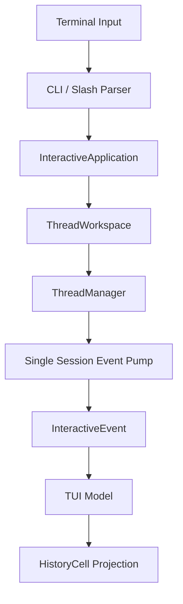

### 7.1 Application 所有权

- `InteractiveApplication` 是交互式产品生命周期 owner，负责 attach Thread、提交输入、处理中断、Approval、Slash Command 和 shutdown。
- `ThreadWorkspace` 负责当前 Thread 选择、new/resume/continue/rename/delete 等 Thread 级操作。
- Application 通过 generation 隔离旧 Thread 的迟到 Event，避免 Resume 或 Clear 后污染新界面。
- TUI 只消费 `InteractiveEvent` 和 `protocol.Event`，不直接读取 Session mutable state。

### 7.2 数据模型职责

| 模型 | 职责 |
|---|---|
| `InteractiveOptions` | 构造 InteractiveApplication 所需的 Workspace、Session Configuration 和 UI 限制。 |
| `InteractiveApplication` | 交互生命周期、active Thread attachment、event pump、pending interaction 和 shutdown owner。 |
| `ThreadWorkspace` | ThreadManager 上层的当前 Thread 选择与事务化切换边界。 |
| `ThreadViewSnapshot` | attach 时提供给 UI 的完整可渲染快照：generation、Thread、完整 SessionConfiguration、Items、Usage 与 ContextWindow。 |
| `SessionOption` | `/resume` 列表中的稳定候选项。 |
| `SkillOption` | `/skills` 展示和启停操作所需 read model。 |
| `MCPServerStatus` | 单个 MCP Server 的启用、认证、Tool、Resource 和错误摘要。 |
| `MCPInventory` | `/mcp` 的 Server 集合。 |
| `StatusSnapshot` | `/status` 的 Thread、Provider、Usage、Permission、Skill/MCP revision 聚合。 |
| `InteractiveEvent` | Application 到 TUI 的封闭事件族。 |
| `SessionEventObserved` | 带 generation 的 protocol Event。 |
| `ApprovalRequested` | UI 需要展示 Approval 时的 typed request。 |
| `UserInputRequested` | UI 需要展示结构化问题时的 typed request。 |
| `ThreadAttached` / `ThreadAttachFailed` | Thread 切换事务结果。 |
| `SessionsLoaded` | Resume picker 异步加载结果。 |
| `SkillsLoaded` / `SkillEnabledSet` | Skill 浏览和启停结果。 |
| `MCPInventoryLoaded` | MCP inventory 异步查询结果。 |
| `fullscreenExitState` | Fullscreen TUI 的 shutdown-first、bounded timeout、空 active-frame drain 与最终 quit 状态机；不进入 Application Event 或 History。 |
| `AppExitInfo` | renderer 停止且终端恢复后返回 CLI 的 token usage、Thread identity、resume hint 与退出原因。 |
| `HistoryCell` | TUI 中一个可重放、可渲染的历史单元接口。 |
| `ActiveHistoryCell` | 尚未完成的流式或工具活动投影。 |
| `AgentMessageCell` | 最终/流式 Assistant Markdown 投影。 |
| `ToolHistoryCell` 与具体 Tool Cell | `ToolHistoryCell` 聚合 live Tool activity；渲染时按类型投影为 `ExecCell`、`ExploreCell`、`FileChangeCell`、Web/Image Cell 或 `GenericToolCell`。 |
| `ProposedPlanCell` / `CollabAgentHistoryCell` | 分别展示 Plan Mode 最终计划和 Multi-Agent 控制操作。 |

### 7.3 Slash Command 子架构

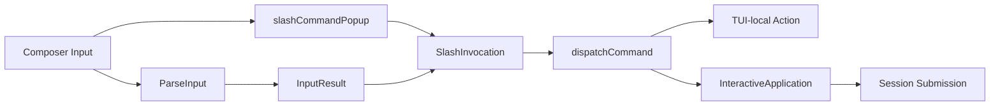

Slash Command 属于 Interface control plane，而不是模型 Tool：解析和补全留在 TUI；Thread、Mode、Compaction、Skill、MCP 等实际操作通过 `InteractiveApplication` 进入既有 Application/Session 主链。`/status`、`/copy` 等纯 UI 查询可以本地完成，但不能绕过 Application 直接修改 Session 状态。

| 模型 | 职责 |
|---|---|
| `SlashCommand` | 内置命令枚举，并提供名称、说明、inline 参数支持和 running-task 可用性规则。 |
| `SlashInvocation` | 已解析的 command + arguments。 |
| `InputResult` | 普通用户文本与 SlashInvocation 的互斥解析结果。 |
| `TaskSubmission` | TUI 提交普通或 Plan Mode 用户任务时的 content、client ID 和 mode override。 |
| `slashCommandPopup` | TUI 私有的筛选结果、选择游标和 dismissal 状态。 |

## 8. Thread 与持久化架构

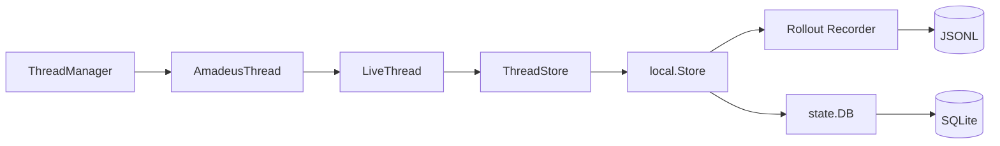

### 8.1 两种持久化事实

- JSONL 保存完整、顺序化、可恢复的 canonical Rollout。
- SQLite 保存 Thread metadata index，用于 list、resume picker、rename、archive 和快速查询。
- SessionID 只由各 Thread Rollout 的 SessionMeta 保存；SQLite 不复制 SessionID，也不以 SessionID 路由 Thread。
- SQLite 可以从 Rollout 重建，因此它不能成为对话历史或 Turn 状态的第二事实源。
- `LiveThread` 串行化 writer 操作，确保 materialize、append、flush 和 close 顺序。

### 8.2 数据模型职责

| 模型 | 职责 |
|---|---|
| `ThreadManager` | 生成 UUIDv7 ThreadID，创建、恢复、查询和关闭 live Thread；也是 child spawn/internal resume 的 AgentHost 实现。 |
| `AmadeusThread` | 对外 Thread handle，持有 SessionID、ThreadID、可选 ParentThreadID，并聚合 Session、SessionIo、LiveThread 和 AgentControl。 |
| `LiveThread` | 一个 Thread writer 的并发安全 façade；控制是否 materialized、buffered append 和 shutdown。 |
| `ThreadStore` | Thread persistence port；定义 materialize、append、load、list、parent traversal、rename、archive、delete、writer close。 |
| `CreateInput` | 首次 materialize Thread 时的 SessionID、ThreadID、source 与 metadata 输入。 |
| `InitialHistory` | New 或 Resumed Thread 的初始 Rollout lines。 |
| `AppendResult` | 追加后的 sequence、metadata/index 同步结果。 |
| `rollout.Line` | JSONL 单行 envelope：schema version、sequence、timestamp 和 item。 |
| `RolloutItem` | canonical item interface。 |
| `SessionMetaItem` | Thread 创建事实：SessionID、ID、可选 ParentThreadID、source、CWD、title、model、git metadata、created time。 |
| `ResponseItem` | 用户、Assistant、ToolCall、ToolResult 的 provider-neutral canonical item。 |
| `CompactedItem` | Compaction summary、replacement history、覆盖 sequence 和 source hash。 |
| `TurnContextItem` | TurnContext 的 durable DTO。 |
| `EventMsgItem` | 需要持久化和 Resume replay 的 typed EventMsg。 |
| `StoredThread` | SQLite 中的 Thread metadata read model。 |
| `ListQuery` | Thread list filter；默认排除 archived 和 SubAgent，可显式包含。 |
| `state.DB` | metadata index port。 |
| `local.Store` | JSONL recorder 与 SQLite DB 的本地 ThreadStore 实现和协调者。 |

## 9. Protocol、Event 与 Rollout 模型

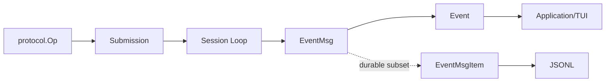

### 9.1 输入操作模型

| 模型 | 职责 |
|---|---|
| `Op` | Session 输入操作的封闭接口。 |
| `UserInputOp` | 新 Turn 或 same-turn steer 的用户文本，并可携带 Thread settings override。 |
| `CompactOp` | 请求显式 Compaction Turn。 |
| `InterruptOp` | 取消当前 ActiveTurn，不关闭 Session。 |
| `ShutdownOp` | 关闭 Session loop。 |
| `ApprovalDecisionOp` | 回答一个 pending Approval waiter。 |
| `UserInputAnswerOp` | 回答 `request_user_input` waiter。 |
| `ThreadSettingsOp` | 在没有 active Turn 时更新 Mode。 |
| `ThreadSettingsOverrides` | 用户消息附带的 request-scoped collaboration mode override。 |

Tab queue 不增加新的 `Op`：输入在 Fullscreen TUI 中 enqueue 时尚未跨越 Submission boundary，只有 terminal 后 dequeue 才创建普通 `UserInputOp`。因此 Protocol 仍只有 Started/Steered admission，不存在 Queued admission。

### 9.2 输出事件模型

| 模型 | 职责 |
|---|---|
| `SessionConfiguredEvent` | Session 启动后公布冻结配置摘要。 |
| `ThreadSettingsAppliedEvent` | Thread settings 已应用完成，并携带实际生效的完整 SessionConfiguration。 |
| `TurnStartedEvent` | Turn 生命周期开始。 |
| `TurnCompleteEvent` | completed/blocked/failed 的 terminal fact。 |
| `TurnAbortedEvent` | 用户中断或取消导致的 terminal fact。 |
| `ErrorEvent` | 可持久化的产品错误事实。 |
| `StreamErrorEvent` | Provider reconnect/retry 状态；区分是否将重试。 |
| `ItemStartedEvent` | Assistant、Reasoning、Tool、Plan 或 Collaboration item 开始。 |
| `ItemCompletedEvent` | 一个稳定 TurnItem 完成。 |
| `AgentMessageContentDeltaEvent` | Assistant 流式文本增量。 |
| `ReasoningContentDeltaEvent` | Reasoning 流式增量。 |
| `CommandOutputDeltaEvent` | 长运行 Process 输出增量。 |
| `TokenCountEvent` | Provider usage 和估算输入 token。 |
| `ApprovalRequestEvent` | Tool 需要 UI/CLI 决策。 |
| `RequestUserInputEvent` | Agent 需要结构化用户输入。 |
| `PlanUpdateEvent` / `PlanDeltaEvent` | `update_plan` 和 proposed plan 的 typed lifecycle。 |
| `ContextCompactedEvent` | Compaction 完成后的 UI/diagnostic fact。 |
| `SubagentNotificationEvent` | child terminal result 注入 parent context 的 durable fact。 |
| `ShutdownCompleteEvent` | Session 完全终止。 |

### 9.3 TurnItem 模型

| 模型 | 职责 |
|---|---|
| `TurnItem` | live、Resume 和 Inline 的统一展示事实。 |
| `ItemKind` | user、assistant、reasoning、tool、command、file、plan、compaction、collaboration 分类。 |
| `ItemStatus` | in-progress、completed、failed、declined。 |
| `ToolResult` | completed Tool 的 display-safe 结果。 |
| `CollabAgentToolCallItem` | Multi-Agent 控制操作的 typed UI/Event payload。 |
| `UpdatePlanArgs` / `PlanItemArg` / `StepStatus` | `update_plan` 的稳定任务计划参数和步骤状态模型。 |
| `PlanDeltaEvent` | Plan Mode 最终建议计划的流式 typed payload；完成态落入 `TurnItem` 的 plan item。 |

## 10. Session、Turn 与 Task 架构

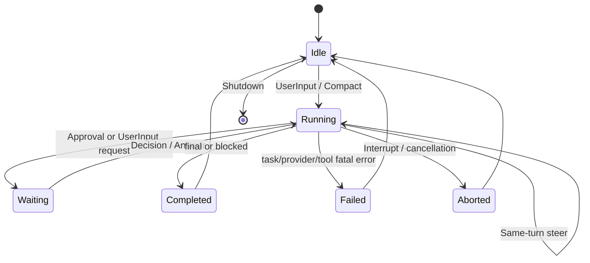

### 10.1 Session Loop

Session loop 只处理以下协调工作：

- 校验和路由 Submission。
- 决定 user input 是创建新 Turn 还是 steer 当前 Turn。
- deferred 不能立即执行的 Compact/Settings 操作。
- 管理 Approval 和 UserInput waiter。
- 接收 RunningTask completion，先持久化 terminal fact，再发布 Event。
- shutdown 时取消 active Turn，并等待清理完成。

模型循环、Tool 执行和 Compaction 算法不直接写在 Session select loop 中。

Session 不保存 next-turn user queue。运行中 Enter 已提交输入仍由 Session 决定 Started/Steered；运行中 Tab 输入由 TUI 等待 terminal，随后作为新的普通 Submission 进入 Session。

### 10.2 数据模型职责

| 模型 | 职责 |
|---|---|
| `SessionState` | Session 的可恢复状态，目前由冻结 `Configuration` 和 `context.Manager` 组成。 |
| `SessionIo` | Thread/Application 使用的输入输出端口：Submissions、Events、Terminated、admission/steer helper。 |
| `SpawnArgs` | 创建 Session 所需 SessionID、ThreadID、可选 ParentThreadID、InitialHistory、State、Services 和 Adapters。 |
| `Session` | 单线程 select loop 的 owner；管理 active Turn、deferred submissions、waiters 和 lifecycle channels。 |
| `ActiveTurn` | 当前 Turn 的协调状态：SubmissionID、RunningTask、TurnState、TaskOutput。 |
| `TurnState` | Turn-scoped pending interactive requests 和 pending same-turn input。 |
| `TurnInput` | 可被追加到当前 Turn 的输入 sum type。 |
| `UserTurnInput` | 文字 same-turn input，包含 content 和 client ID。 |
| `TurnInputQueue` | Turn-scoped 并发安全队列，可 drain、seal，防止终态之后继续写入。 |
| `SessionTask` | Regular/Compact Task 的统一执行接口。 |
| `TaskKind` | `regular` 与 `compact`。 |
| `regularTask` | 执行正常 continuation loop，持有 goal、TurnState、events 和 ModelClientSession。 |
| `compactTask` | 执行显式 Compaction。 |
| `RunningTask` | SessionTask 的 goroutine、context、cancel cause、panic capture 和 Completion channel owner。 |
| `Completion` | RunningTask 返回 Session 的 terminal envelope。 |
| `TaskOutput` | Task 的 RolloutItems、summary、outcome、usage 和 ToolCallCount。 |
| `TurnContext` | 一个 Turn 的稳定 runtime settings：Thread/Turn、Provider、Model、Reasoning、CWD、Mode、OutputSchema。 |
| `TurnContextItem` | TurnContext 的可持久化纯数据版本。 |

## 11. Model Step 与 Continuation Loop

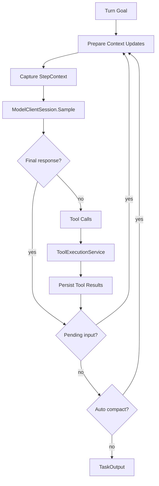

### 11.1 数据模型职责

| 模型 | 职责 |
|---|---|
| `StepContext` | 单次 sample 的 Prompt、Model、BaseInstructions、ToolRouter 和 revision 集合。 |
| `SampleRequest` | Engine 到 ModelClientSession 的 provider-neutral sampling 输入。 |
| `SampleResult` | `final` 或 `tool_calls` 二选一的采样结果。 |
| `SampleKind` | continuation loop 分支判定。 |
| `CompleteRequest` | Compaction 等不允许 Tool 的完整模型请求。 |
| `ModelClientSession` | Turn-scoped stream/reconnect owner；在同一 Turn 的 sampling 与 compaction 间复用 client。 |
| `ModelClientSessionConfig` | stream retry 次数、idle timeout 和可测试 backoff/sleep。 |
| `TurnBudget` | 最大 sample、Tool call、duration 和 warning ratio。 |
| `CompactRequest` | Compactor 所需 history projection、ModelSession、Reasoning 和 EventSink。 |
| `Compactor` | 将可覆盖历史变成 CompactedItem + usage item。 |

Continuation loop 当前直接维护 sample 数、Tool call 数、elapsed time 和累计 `llm.Usage`；这些运行中计数尚未封装为独立公开数据模型。

## 12. Prompt、Context 与 AGENTS.md

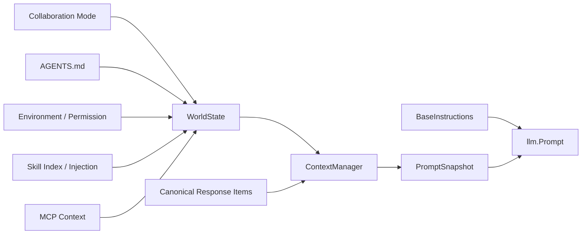

### 12.1 Prompt 分层

1. `BaseInstructions`：模型/人格级稳定基础指令。
2. Collaboration Mode：Default 或 Plan developer guidance。
3. WorldState：AGENTS.md、环境、权限、Skills、MCP、active SubAgents。
4. Canonical history：用户、Assistant、ToolCall、ToolResult、Compaction replacement。
5. ToolSpec：每个工具自身的使用说明和 JSON Schema。

### 12.2 数据模型职责

| 模型 | 职责 |
|---|---|
| `ModelMessages` | 模型消息资产聚合：instructions template、personality variables、modes、subagent instructions、compaction prompt。 |
| `ModelInstructionsVariables` | personality 文本变量。 |
| `CollaborationModeMessages` | Default/Plan developer instructions。 |
| `BaseInstructions` | 已解析 personality 的系统基础指令。 |
| `context.Manager` | canonical model-visible history、WorldState updates、usage 和 revision 的唯一 owner。 |
| `UpdateKey` | collaboration、agents、environment、permission、skills、MCP 的稳定更新槽位。 |
| `WorldState` | 有序 contextual fragments 集合及 revision。 |
| `ContextualUserFragment` | 运行时注入模型、但不代表真实用户意图的上下文片段。 |
| `SkillInjection` | 用户通过 `$skill-name` 显式选择后注入的 Skill 正文事实。 |
| `UsageSnapshot` | Provider usage 与估算输入 token。 |
| `PromptSnapshot` | 一次 sample 的模型消息及 history/world-state revision。 |
| `RolloutMessageProjection` | 从 Rollout 投影得到的 provider-neutral消息及 source sequences。 |
| `AgentsMdManager` | 扫描、合并、刷新用户级和目录层级 AGENTS.md。 |
| `agentsmd.Document` | 单个 AGENTS.md 的来源、路径、scope、hash 和正文。 |
| `LoadedAgentsMd` | 有序文档集合和整体 revision。 |

## 13. LLM Domain 与 Provider Adapter

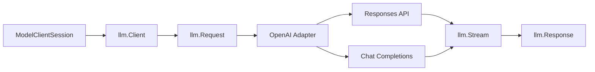

### 13.1 Domain/Adapter 边界

- `internal/llm` 不依赖具体 HTTP SDK，定义稳定 Request、Response、Stream、Usage、ModelInfo 和 ProviderError。
- `internal/llm/openai` 负责 Responses/Chat wire 编解码、Dialect 字段归一化和 transport retry。
- request retry 属于 Provider adapter；已建立连接后的 stream reconnect 属于 `ModelClientSession`。
- Engine 只理解 tool calls、final response、usage 和 typed provider error，不理解具体 JSON wire shape。

### 13.2 数据模型职责

| 模型 | 职责 |
|---|---|
| `Client` | Provider-neutral `Complete`、`Stream`、`Model`、`Capabilities` port。 |
| `ModelInfo` | 当前模型的 context window、auto compact、Tool output、parallel calls、image modalities 和 ModelMessages。 |
| `Capabilities` | Provider transport 支持的 wire 能力。 |
| `Request` | Provider-neutral模型请求。 |
| `Prompt` | BaseInstructions、Input、Tools、parallel flag 和 OutputSchema。 |
| `ToolSpec` | LLM domain 中的工具声明 DTO。 |
| `ResponseItem` | system/developer/user/assistant/tool 的统一消息模型。 |
| `ContentPart` | text 或 image 多模态内容。 |
| `ToolCall` | 模型返回的 call ID、name 和 arguments。 |
| `Response` | 最终 message、finish reason、usage 和 provider request identity。 |
| `Stream` | 顺序读取 StreamChunk 的端口。 |
| `StreamChunk` | content/reasoning delta、ToolCalls、usage 和 terminal finish reason。 |
| `Usage` | input、cached input、output、reasoning 和 total token。 |
| `ReasoningConfig` | request-scoped thinking/reasoning effort。 |
| `ProviderError` | kind、code、status、request ID、retryability 和 retry delay。 |

## 14. Tool 架构

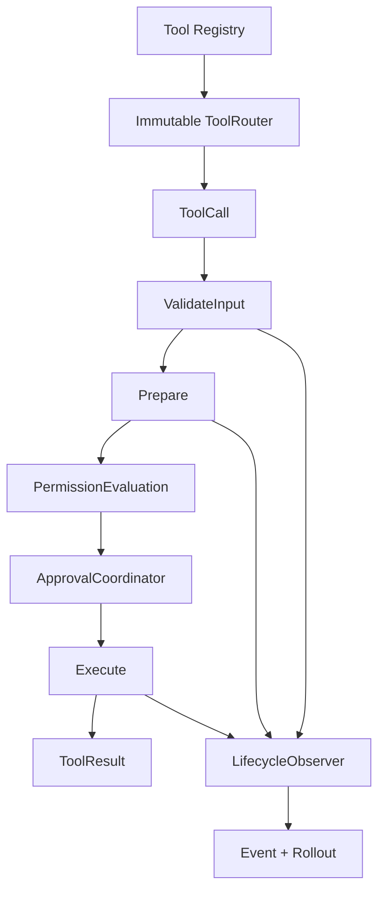

### 14.1 Tool 调用阶段

1. Registry 在 Session 初始化时注册 ToolDefinition。
2. Step capture 根据 Mode、Model、配置、Skill/MCP revisions 和 SubAgent source 生成 immutable ToolRouter。
3. Model 返回的 ToolCall 只能在该 Router 中解析。
4. Tool 先校验 JSON，再 Prepare 路径/preview/metadata，再做 Permission/Approval，最后 Execute。
5. ToolResult 同时包含模型文本、多模态 Parts、typed Data 和独立 Display projection。
6. LifecycleObserver 负责 ItemStarted/Completed、canonical ToolResult 和 TUI activity。

### 14.2 数据模型职责

| 模型 | 职责 |
|---|---|
| `ToolSpec` | Tool 名称、说明、Schema、副作用和幂等性。 |
| `SideEffect` | none/read/write/execute/network 分类。 |
| `Exposure` | direct/conditional/deferred/hidden 注册可见性。 |
| `Registration` | Exposure 与 condition key。 |
| `ToolCall` | Engine/Tool domain 的模型调用 DTO。 |
| `Invocation` | 同时携带 typed SessionID、ThreadID、TurnID 和来源的执行 envelope。 |
| `RequestSnapshot` | MCP、Skill、AGENTS.md、ToolRouter revisions。 |
| `ToolDefinition` | `Spec + ValidateInput + Prepare + Execute` contract。 |
| `ToolUseContext` | Tool 执行时的 context、invocation 和 request snapshot。 |
| `PreparedToolUse` | Prepare 产物、typed state、permission evaluation 和 preview。 |
| `ToolResult` | 模型输出、UI display、metadata、artifacts、typed data。 |
| `ToolDisplayResult` | UI 不解析模型 Text 即可展示的安全结果。 |
| `ToolCallOutcome` | completed/failed/denied/interrupted、duration、error 和 metadata。 |
| `ToolExecution` | Call、Output 和 Outcome 的完整执行结果；`PreparedToolUse.State` 只存在于执行链内部。 |
| `Registry` | Session-scoped ToolDefinition mutable registration owner。 |
| `Entry` | Registry 中 spec、definition、exposure、condition 和 binding ID。 |
| `ToolRouter` | request-scoped immutable exact binding snapshot。 |
| `ExecutionScope` | 一批 ToolCalls 的 Turn/Session identity、Router 和 observer。 |
| `ToolExecutionService` | 有界并发、顺序约束、Approval、Permission、interaction 和 lifecycle 调度。 |

### 14.3 Workspace、FileChange 与 TextDiff

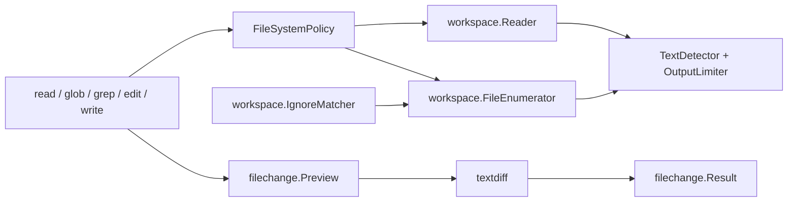

| 模型 | 职责 |
|---|---|
| `workspace.Reader` | 通过 FileSystemPolicy 解析路径，并按行数、字节数和单行长度限制读取文本文件。 |
| `ReadRangeOptions` / `ReadRangeResult` | 文件区间读取的限制参数，以及分页、截断和文件统计结果。 |
| `workspace.FileEnumerator` | 在 policy 和 ignore rules 下枚举文件，处理 hidden、symlink、上限和 partial 结果。 |
| `EnumerateOptions` / `FileEntry` / `EnumerateResult` | 文件枚举请求、条目和 bounded result。 |
| `workspace.IgnoreMatcher` | 合并 `.gitignore` 与 `.ignore` 规则，并执行目录、锚定和 negation 匹配。 |
| `TextDetector` / `OutputLimiter` | 拒绝非 UTF-8/NUL 内容，并保证 Tool 输出不超过字节预算。 |
| `filechange.Preview` | 修改前的路径、operation、hash、diff stats、hunks 和 unified diff。 |
| `filechange.Result` | apply 后的路径、operation、原始/更新内容、diff 和 user-modified 标记。 |
| `textdiff.Stats` | 文本变化的 insertion/deletion 统计；`textdiff` 同时生成 bounded unified diff。 |

## 15. Approval、Permission 与文件系统

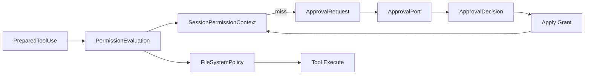

### 15.1 强制边界

- `FileSystemPolicy` 决定目标路径是否在 workspace、temporary、read-only 或 denied root 中。
- `SessionPermissionContext` 只保存当前 Session 的可复用授权，不改变底层文件系统边界。
- ApprovalPort 由 CLI/TUI 实现；Tool 和 Policy 不依赖具体终端。
- SubAgent 使用 deny-only ApprovalPort，因此不会产生无人消费的 UI waiter。
- `edit`/`write` 使用 read-before-write、preview、Approval 后 revalidation 和 atomic apply。

### 15.2 数据模型职责

| 模型 | 职责 |
|---|---|
| `PermissionEvaluation` | Allow、Deny 或 Ask 的 Tool Prepare 结果。 |
| `PermissionGrant` | read directory、edit directory、exact command 或 external key 的可复用授权。 |
| `SessionPermissionContext` | 一个 Session 的 in-memory grant store。 |
| `ApprovalRequest` | Tool、风险、cause、permission key、presentation 和 raw arguments。 |
| `ApprovalPresentation` | UI title、description、details、options 和 optional diff。 |
| `ApprovalDecision` | allow/deny、once/session、source 和 reason。 |
| `ApprovalCoordinator` | 查询 Session Grant、调用 ApprovalPort、验证 decision 并应用 grant。 |
| `ApprovalPort` | 用户决策端口。 |
| `CommandAssessment` | CommandGuard 对命令风险和 disposition 的结果。 |
| `PermissionProfile` | read host、workspace、temporary、read-only、denied roots。 |
| `FileSystemPolicy` | canonical path resolution 和强制访问判断。 |
| `ResolvedPath` | requested、absolute、canonical、access 和 root source。 |
| `filechange.Preview` | 文件修改前的 operation、hunks 和统计。 |
| `filechange.Result` | apply 后的路径、operation、原始/更新内容、diff 和 user-modified 标记。 |

## 16. Command 与 Process 架构

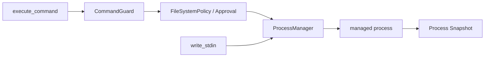

### 16.1 数据模型职责

| 模型 | 职责 |
|---|---|
| `process.Command` | 启动进程的 shell/executable、args、cwd、timeout、TTY 和输出上限。 |
| `process.Attribution` | Skill script 等来源的 name、resource、revision。 |
| `process.ID` | 长运行进程身份。 |
| `process.State` | running/completed/cancelled/timed_out/failed。 |
| `process.Snapshot` | owner-scoped 可观察进程状态、输出、退出码和时间。 |
| `process.Manager` | Session-scoped process registry、stdin、wait、cancel 和 cleanup owner。 |
| `ExecRequest` | `execute_command` 的 normalized command request。 |
| `ProcessResult` | ToolResult 中返回 process ID、state、output、exit code、耗时和输出截断状态。 |

### 16.2 Sandbox Runner 边界

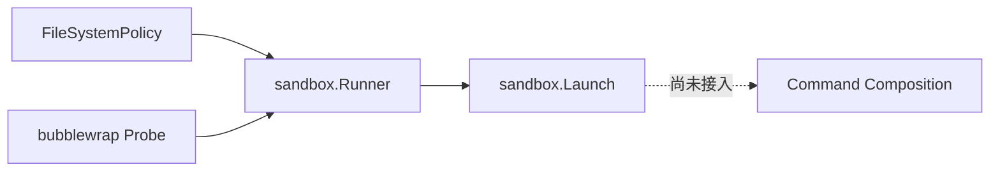

`internal/sandbox` 已实现 Linux bubblewrap 探测和 launch 参数生成，但当前 Composition Root 与 `execute_command` 尚未使用该 Runner；命令执行的强制边界目前主要是 CommandGuard、Approval、CWD/FileSystemPolicy 检查和 ProcessManager。白皮书把 Sandbox 标记为“可用基础设施、待接入主链”，避免把目标架构误写成现状。

| 模型 | 职责 |
|---|---|
| `sandbox.IsolationMode` | `sandboxed` 与 `unsandboxed` 探测结果。 |
| `sandbox.Runner` | 探测 bubblewrap，并根据 PermissionProfile 生成隔离 launch。 |
| `sandbox.Launch` | executable、arguments、directory 和最终 isolation mode。 |
| `sandbox.Options` | 注入 LookPath、Probe 和 GOOS，支持平台适配与测试。 |

## 17. MCP 与 Skill 架构

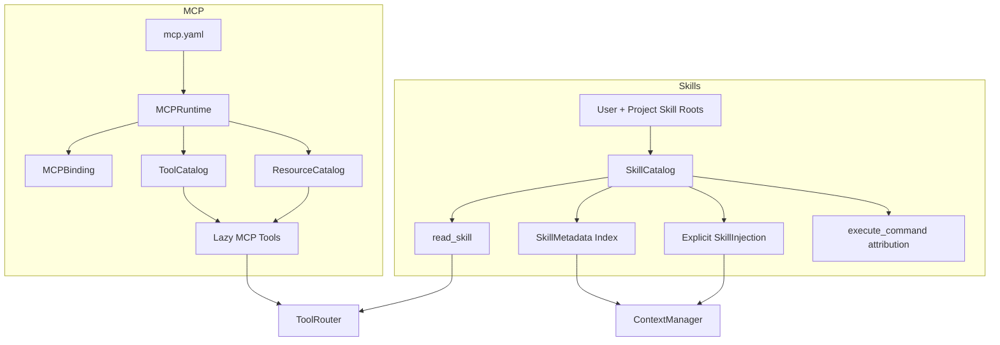

### 17.1 MCP 模型职责

| 模型 | 职责 |
|---|---|
| `mcp.Config` | 用户级与项目级 MCP Server 配置。 |
| `ServerConfig` | stdio 或 streamable HTTP 连接参数。 |
| `MCPRuntime` | Session-scoped client、connection generation、catalog cache 和 revision owner。 |
| `MCPBinding` | 当前全部 Server 的一致 binding revision。 |
| `MCPServerBinding` | 单个 Server 的连接/Tool/Resource generation 状态。 |
| `MCPToolMetadata` | sanitized schema、read-only/idempotent/parallel hints 和 revision。 |
| `MCPResourceMetadata` | URI、name、description、MIME type 和 revision。 |
| `ToolCatalog` | 一个 Server 的 Tool metadata snapshot。 |
| `ResourceCatalog` | 一个 Server 的 Resource metadata snapshot。 |
| `RemoteResult` | MCP Tool 的不可信远端结果。 |
| `RemoteResource` / `RemoteResourceContent` | MCP Resource discovery 与读取结果。 |

### 17.2 Skill 模型职责

| 模型 | 职责 |
|---|---|
| `SkillCatalog` | 用户级/项目级 Skill discovery、override、enabled state、revision 和 on-demand body owner。 |
| `SkillMetadata` | name、description、source、scope、policy、resources、size 和 revision。 |
| `SkillDocument` | SkillMetadata + root + 当前 `SKILL.md` 正文。 |
| `Policy` | 当前主要表达 `AllowImplicitInvocation`。 |
| `SkillResource` | references/scripts/assets 下文件的 path、kind、size 和 revision。 |
| `SkillInjection` | 显式 `$skill-name` 注入 Context 的正文。 |
| `ScriptInvocation` | execute_command 识别出的 Skill script attribution。 |
| `SkillOption` | Application/TUI 的启停 read model。 |

## 18. Web 与图片能力

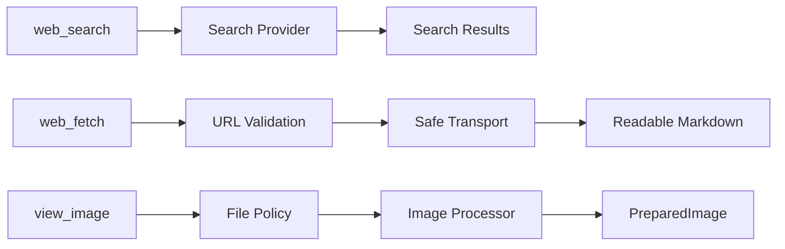

### 18.1 数据模型职责

| 模型 | 职责 |
|---|---|
| `websearch.Result` | 单条标准化搜索结果：title、URL 和 snippet。 |
| `websearch.Provider` | Search backend port。 |
| `websearch.Service` | timeout、结果上限、归一化和 Tool-facing search owner。 |
| `websearch.ServiceOptions` | timeout、最大结果数和 transient retry delay。 |
| `websearch.Error` | provider、错误分类、HTTP status 和底层错误。 |
| `webfetch.Document` | 最终 URL、content type、title、Markdown、partial 标记和读取字节数。 |
| `webfetch.Options` | 最大字节、重定向、timeout、限速、DNS/dial/proxy/TLS 安全依赖。 |
| `webfetch.Fetcher` | 安全网络读取 port。 |
| `imageprep.Detail` | high 或 original。 |
| `SourceLimits` | source bytes、dimensions 和 pixel 安全上限。 |
| `PreparationLimits` | prepared max dimension 和 patch budget。 |
| `imageprep.Options` | high/original 两套处理约束。 |
| `Processor` | 图片格式检测、静态化、缩放和重编码 owner。 |
| `PreparedImage` | source/prepared metadata、bytes 和 Base64 payload。 |

## 19. Basic Multi-Agent 架构

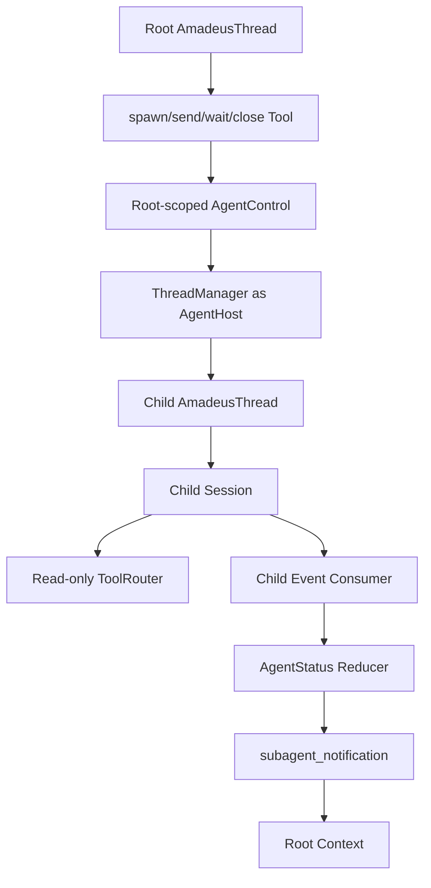

### 19.1 关键边界

- SubAgent 是完整 `AmadeusThread/Session`，不是 Tool handler 内嵌 provider runner。
- `AgentControl` 只保存 tree metadata、status、reservation 和控制操作，不成为第二 Thread registry。
- child 使用 fresh Context，不复制 parent reasoning、Tool history、Plan 或 compaction history。
- child 固定 depth 1、role `explorer`，只允许 read/glob/grep 和条件 read_skill/web_search。
- child Approval 被 policy deny；不会阻塞 Root TUI。
- completion 通过 parent Session canonical append 成为 `<subagent_notification>`。

### 19.2 数据模型职责

| 模型 | 职责 |
|---|---|
| `SessionSource` | tagged source：Root 或 SubAgent。 |
| `SubAgentSource` | parent ThreadID、depth、nickname 和 role。 |
| `AgentMetadata` | AgentControl 的稳定身份 read model。 |
| `AgentStatus` | pending/running/interrupted/completed/errored/shutdown/not_found。 |
| `multiagent.Options` | Control 的 max agents/depth。 |
| `SpawnChildRequest` | AgentControl 到 ThreadManager 的 child 创建请求。 |
| `AgentRuntime` | AgentControl 操作 child Thread 的窄 runtime port。 |
| `AgentHost` | ThreadManager 实现的 spawn/notify port。 |
| `Control` | root tree reservation、status、wait、send、close 和 event consumer owner。 |
| `AgentRecord` | WorldState 所需 metadata + status snapshot。 |
| `SpawnResult` | `spawn_agent` 的 agent ID 和 nickname。 |
| `StatusSnapshot` | wait/send/close 所需 Agent 状态 read model。 |
| `WaitResult` | statuses + timed_out。 |
| `Notification` | child terminal status 到 parent 的内部通知。 |
| `CollabAgentTool` | spawn/send/wait/close 分类。 |
| `CollabAgentToolCallStatus` | in-progress/completed/failed。 |
| `CollabAgentRef` | TUI 需要的 ThreadID、nickname 和 role。 |
| `CollabAgentState` | AgentStatus wrapper。 |
| `CollabAgentToolCallItem` | live/Resume/Inline 唯一 collaboration 展示协议。 |

### 19.3 AgentStatus 状态机

```mermaid
stateDiagram-v2
    [*] --> pending_init
    pending_init --> running: TurnStarted
    running --> completed: TurnComplete success
    running --> errored: Error or failed TurnComplete
    running --> interrupted: TurnAborted
    completed --> running: send_input
    errored --> running: send_input
    interrupted --> running: send_input
    pending_init --> shutdown: ShutdownComplete
    running --> shutdown: close/shutdown
    completed --> shutdown: close/shutdown
    errored --> shutdown: close/shutdown
    shutdown --> not_found: record removed
```

## 20. TUI Projection 架构

```mermaid
flowchart LR
    Event[protocol.Event]
    Reducer[Application/TUI Reducer]
    Active[ActiveHistoryCell]
    Complete[Completed HistoryCell]
    Render[Styled Lines]
    Inline[Inline Output]
    Resume[Resume Replay]

    Event --> Reducer
    Reducer --> Active
    Reducer --> Complete
    Active --> Render
    Complete --> Render
    Complete --> Inline
    Complete --> Resume
```

### 20.1 Projection 原则

- 流式 Event 更新 active cell；terminal ItemCompletedEvent 将其关闭或替换。
- Resume 只使用 canonical completed items，不恢复过去 spinner。
- UI 使用 `ToolDisplayResult`、`TurnItem.CollabAgent` 等 typed fields，不解析 ToolResult 文本反推状态。
- Approval、UserInput request 和 Diff 是 overlay/application state，不写入普通聊天气泡。
- Composer 使用首行 prompt 与 continuation gutter；编辑状态由 Bubble Tea textarea 管理，展示层按全局视觉 cursor 行投影最多五行的可见窗口。
- Composer input state 拥有 attachment-scoped `NextTurnQueue`：Tab enqueue 不产生 HistoryCell，terminal 后每次 FIFO 提交一条；aborted/blocked 或提交前失败恢复 composer。
- queued preview 最多展示三条单行摘要和剩余数量，Slash Popup/交互 overlay 激活时隐藏，不进入 scrollback、statusline 或 Resume replay。
- running Turn 中 Composer 存在 queueable ordinary draft 时，`footerProps.HasQueueableDraft` 纯派生为 true；Footer 用 `tab to queue message`/`tab to queue` 临时替换固定 statusline，Plan indicator 只在可容纳时保留。该 hint 不进入 footerState、StatusLineItem 或 Runtime Event。

### 20.2 主要展示模型

| 模型 | 职责 |
|---|---|
| `HistoryCell` | `DisplayLines`、`RawLines`、stream continuation contract。 |
| `ActiveHistoryCell` | 当前流式 item 或工具 activity。 |
| `AgentMessageCell` | Assistant Markdown。 |
| `ProposedPlanCell` | Plan Mode 最终计划。 |
| `ToolHistoryCell` | 聚合一个或多个 live Tool activity，并消费 started/completed Event。 |
| `ExecCell` / `ExploreCell` | 分别展示命令进程，以及 read/glob/grep 等探索活动。 |
| `FileChangeCell` / `GenericToolCell` | 分别展示 edit/write 结果，以及没有专用投影的通用 Tool。 |
| `WebSearchCell` / `WebFetchCell` / `ViewImageCell` | Web 与图片 Tool 的稳定完成态投影。 |
| `MCPCommandHistoryCell` / `MCPInventoryCell` | `/mcp` 命令和 MCP inventory 的展示模型。 |
| `CollabAgentHistoryCell` | spawn/send/wait/close 的 Codex 风格展示。 |
| `WarningHistoryCell` / `ErrorHistoryCell` | 非普通对话的 warning/error。 |
| `approvalDialog` | `ApprovalPresentation` 的 TUI 私有交互状态。 |
| `NextTurnQueue` / `QueuedUserInput` | Fullscreen pending FIFO、InFlight/start-pending gate、ThreadID/generation/Mode isolation 和 bounded preview source。 |
| `footerProps.HasQueueableDraft` | 从 running + Composer ParseInput + overlay state 纯派生的 transient queue guidance input；不持久化。 |

### 20.3 One-shot Renderer

```mermaid
flowchart LR
    Event[protocol.Event]
    Renderer[render.AgentRenderer]
    Stdout[Assistant Text / stdout]
    Stderr[Status / stderr]

    Event --> Renderer
    Renderer --> Stdout
    Renderer --> Stderr
```

非 TUI 的 one-shot 模式复用同一 typed Event 流，但通过 `render.AgentRenderer` 做轻量终端投影：Assistant delta 写 stdout，Tool/Turn/Usage 状态写 stderr。它不拥有 Session 状态，也不从日志文本反推事件。

| 模型 | 职责 |
|---|---|
| `render.AgentRenderer` | 实现 `protocol.EventSink`，串行、安全、bounded 地投影 one-shot Event。 |

## 21. Audit、Logging 与诊断

```mermaid
flowchart LR
    Runtime[Runtime/Tool]
    Audit[Audit Sink]
    Log[Logging]
    JSONL[Audit JSONL]
    Status[/status]
    MCP[/mcp]
    Skills[/skills]

    Runtime --> Audit --> JSONL
    Runtime --> Log
    Runtime --> Status
    Runtime --> MCP
    Runtime --> Skills
```

| 模型 | 职责 |
|---|---|
| `audit.Record` | Tool/Approval 审计事实，记录参数摘要、风险、结果、来源、原因和耗时。 |
| `audit.Sink` | 审计写入端口。 |
| `logging.Runtime` | 结构化 logger 与 `trace_llm` 开关；创建 handler 时统一脱敏敏感属性。 |
| `buildinfo.Info` | 版本、commit 和 build metadata。 |
| `app.StatusSnapshot` | 用户可见 runtime 诊断。 |
| `MCPInventory` | MCP capability 诊断。 |
| `SkillOption` | Skill capability 诊断。 |

敏感信息必须在进入普通日志、`config show`、MCP inventory 或 Tool display 前脱敏。完整 Provider payload 只在显式 `trace_llm` 等受控路径中记录。

## 22. 并发与取消模型

```mermaid
flowchart TD
    ProcessCtx[Process Context]
    ManagerCtx[ThreadManager Context]
    SessionCtx[Session Context]
    TurnCtx[RunningTask Context]
    ToolCtx[Tool Call Context]
    ProcCtx[Managed Process Context]
    AgentCtx[Child Session Context]

    ProcessCtx --> ManagerCtx
    ManagerCtx --> SessionCtx
    SessionCtx --> TurnCtx
    TurnCtx --> ToolCtx
    ToolCtx --> ProcCtx
    ManagerCtx --> AgentCtx
```

### 22.1 并发规则

- Session loop 本身串行处理协调状态。
- Bubble Tea reducer 串行拥有 NextTurnQueue；异步 SubmitUser `tea.Cmd` 创建前先同步把 FIFO head 移入 InFlight，避免 terminal/key/admission 竞态重复发送。
- RunningTask 在独立 goroutine 中执行，并通过单值 Completion channel 返回。
- ToolExecutionService 只并行执行声明 parallel-safe 且不会违反 batch 顺序的 Tool。
- ProcessManager 为每个进程维护独立 lock、I/O lock、done channel 和 timeout context。
- AgentControl 的 agents/reservations/nicknames/changed channel 受单一 mutex 保护。
- Thread writer 通过 LiveThread mutex 和 Store writer 保证顺序。

### 22.2 取消规则

- `InterruptOp` 取消 ActiveTurn，不关闭 Session 或 child Agent。
- `ShutdownOp` 关闭 Session；Root Thread 先关闭 AgentControl/children。
- Tool context 取消必须传播到网络、文件、Provider 和 Process 操作。
- cleanup 使用 `context.WithoutCancel` 加有限 timeout，保证 caller 已取消时仍能做必要持久化和资源释放。

## 23. 架构不变量

以下规则应由测试和 architecture guards 长期保护：

1. ThreadManager 是唯一 live Thread registry。
2. Session 是 ActiveTurn 和 pending interactive waiter 的唯一 owner。
3. JSONL 是完整历史事实源，SQLite 只保存 metadata index。
4. Event 必须由 typed EventMsg 表达，TUI 不解析日志字符串获取状态。
5. 同一次模型采样的 Prompt、ToolSpec 和 Tool dispatch 使用同一个 StepContext。
6. Tool 必须经过 Validate、Prepare、Permission/Approval、Execute 主链。
7. Session Grant 不跨 Session，也不从 Root 泄漏给 SubAgent。
8. Prompt 不宣称 ToolRouter 中不存在的能力。
9. MCP/Skill/Web/Image 不建立第二套 Agent Loop、Approval UI 或 Process Runner。
10. SubAgent 是完整 Thread/Session，AgentControl 不直接调用 Provider。
11. terminal Event 在发布给 UI 前必须先持久化。
12. Resume 从 canonical Rollout 重建 Context 和 UI，不重新执行历史 Tool。
13. Root/child 共享 SessionID 但使用不同 ThreadID；registry、Event、Resume 和 Agent target 始终按 ThreadID 路由。
14. Tool Invocation、Audit 和 Provider request metadata 同时携带 SessionID、ThreadID 与 TurnID。
15. SessionMeta 是 SessionID 的 durable source；SQLite StoredThread 不保存 SessionID。
16. Enter steer 与 Tab queue 是不同输入意图；NextTurnQueue 只存在于 Fullscreen input layer，Core/Protocol/Rollout/Context 不保存 Queued Op、admission 或 durable item。
17. matching TurnComplete 每次最多 drain 一条 queued input 且 admission 必须为 Started；aborted/blocked/rejection 和旧 attachment 结果不能把输入发送到错误 Turn。
18. queue hint 只由 footerProps 的 queueable-draft 派生值驱动；running draft 时优先于 passive statusline 并按 full/short 降级，不能成为 footerState、StatusLineItem、HistoryCell 或 Runtime/canonical fact。
19. Config/patch/default/validation/provenance/output 不保存 schema version；`version:` 被 strict decoder 拒绝，`configs/config.yaml.example` 是仓库唯一完整模板且不是自动发现位置。

`internal/architecture/guard_test.go` 通过源码结构检查保护这些边界，例如禁止已移除的旧 Runtime/Planner 抽象重新出现，并验证 Web、Tool、Multi-Agent 等关键 package 分层。

## 24. 新增模块时的接入指南

### 24.1 新增 Tool

1. 在 `internal/tool/builtin` 建立独立 ToolDefinition。
2. 定义稳定 ToolSpec、SideEffect、Exposure 和 Schema。
3. 把路径解析、preview 和 remote metadata 放入 Prepare。
4. 使用 PermissionEvaluation/ApprovalRequest，而不是 Tool 内直接读取终端。
5. Execute 返回 bounded ToolResult、typed Data 和 Display。
6. 如需专用 TUI，新增 typed TurnItem payload 或 ToolDisplay projection，不解析 Text。
7. 添加 ToolRouter、Approval、Rollout、Resume 和 TUI 测试。

### 24.2 新增 Provider

1. 实现 `llm.Client`。
2. 把 wire-specific 结构限制在 adapter package。
3. 正确填充 ModelInfo、Capabilities、ProviderError、Usage 和 FinishReason。
4. request retry 留在 adapter；stream reconnect 交给 ModelClientSession。
5. 添加普通 sampling、Tool calls、reasoning、usage、retry 和 cancellation 测试。

### 24.3 新增 Capability

1. 明确 Session-scoped owner。
2. 定义 revision/binding，必要时加入 RequestSnapshot。
3. 通过 SessionServices 注入，不能由 TUI 或 Tool handler 创建 singleton。
4. 对模型可见时同时更新 Context/Prompt 和 ToolRouter。
5. 定义 shutdown 顺序、Approval 边界和持久化策略。

### 24.4 新增 Agent 类型

1. 保持 child 为完整 Thread/Session。
2. 通过 SessionSource/AgentMetadata 表达身份。
3. 在 StepContext 捕获时应用 Tool policy。
4. Prompt 资产放入 ModelMessages，不在 Tool handler 拼接。
5. AgentControl 只扩展 control plane，不复制 ThreadManager registry。

## 25. Package 导航

| Package | 主要内容 |
|---|---|
| `cmd/amadeus` | Composition Root、CLI、启动与进程级配置。 |
| `internal/config` | 配置模型、分层加载、覆盖、来源追踪、校验和脱敏。 |
| `internal/app` | 交互应用、ThreadWorkspace、Application events。 |
| `internal/interface/cli` | 终端 Approval 等 CLI adapter。 |
| `internal/interface/tui` | TUI reducer、NextTurnQueue、HistoryCell、Slash Command 和 overlays。 |
| `internal/thread/manager` | live Thread registry、Root/child Thread 生命周期。 |
| `internal/thread` | LiveThread 和 ThreadStore port。 |
| `internal/thread/local` | JSONL + SQLite 本地 ThreadStore。 |
| `internal/state/sqlite` | Thread metadata index。 |
| `internal/agent/protocol` | Submission、Op、EventMsg、TurnItem、Multi-Agent protocol。 |
| `internal/agent/session` | Session loop、Task、Turn completion、Step capture。 |
| `internal/agent/engine` | ModelClientSession、continuation primitives、Compactor、Tool events。 |
| `internal/agent/turn` | TurnContext、Mode 和 Personality。 |
| `internal/agent/multiagent` | AgentControl、reservation、status、wait、shutdown。 |
| `internal/context` | `Manager`、WorldState、PromptSnapshot、Rollout projection。 |
| `internal/prompt` | ModelMessages 的 Prompt assembly helper。 |
| `internal/llm` | Provider-neutral model domain。 |
| `internal/llm/openai` | Responses/Chat adapter。 |
| `internal/tool` | Tool contract、Registry、Router、ExecutionService。 |
| `internal/tool/builtin` | 内置 Tool implementations。 |
| `internal/tool/textdiff` | 文件变化统计和 unified diff 生成。 |
| `internal/policy` | Approval、Permission Grant、Command Guard。 |
| `internal/project` | Project root、PathResolver、FileSystemPolicy。 |
| `internal/workspace` | 文件读取、枚举、ignore/glob、文本检测和输出限制。 |
| `internal/filechange` | edit/write preview 与 apply result DTO。 |
| `internal/process` | ProcessManager 和 PTY/stdio lifecycle。 |
| `internal/sandbox` | bubblewrap 探测与隔离 launch 生成；当前尚未接入命令主链。 |
| `internal/agentsmd` | AGENTS.md discovery 与 revision。 |
| `internal/skill` | Skill Catalog、settings、resources、script attribution。 |
| `internal/mcp` | MCP config、runtime、catalog、Tool/Resource adapters。 |
| `internal/websearch` | Search providers/service。 |
| `internal/webfetch` | URL safety、redirect、fetch、Markdown。 |
| `internal/imageprep` | 图片安全限制、缩放和编码。 |
| `internal/rollout` | Canonical Rollout item、codec 和 recorder。 |
| `internal/audit` | 审计 port 与实现。 |
| `internal/logging` | 结构化日志、等级和敏感字段脱敏。 |
| `internal/render` | one-shot typed Event 终端投影。 |
| `internal/buildinfo` | 构建版本、commit 和 build time。 |
| `internal/architecture` | 架构守卫测试，不包含生产 Runtime。 |

## 26. 总结

Amadeus 的核心不是某一个模型、某一个 Tool 或某一个 TUI，而是以下闭环：

```text
Typed Input
→ Thread / Session ownership
→ Turn-scoped Task
→ Request-scoped StepContext
→ Model + Tool continuation
→ Typed Event and canonical Rollout
→ Context rebuild and UI projection
```

只要新增能力继续遵守唯一 owner、typed protocol、canonical persistence、request snapshot、统一 Tool/Approval 主链和明确 cancellation tree，Amadeus 就可以在不复制 Runtime 的前提下持续扩展。
