# Amadeus 架构白皮书

## 1. 阅读指南

Amadeus 是一个使用 Go 实现的本地终端 Coding Agent。学习它的关键，是沿着一次用户请求在系统中的流动路径，逐层理解各个模块如何协作。

本文按以下顺序展开：

1. 先说明代码目录和 package 依赖方向。
2. 再展示整体分层、核心所有权和端到端运行主链。
3. 随后按模块深入说明 Protocol、Thread/Persistence、Agent Loop、Prompt/Context、LLM、Tool、Approval、Process、MCP、Skill、Web/Image、Multi-Agent 和 TUI。
4. 最后说明并发取消、错误、测试和关键事实。

本文以当前 Amadeus 源码和测试为实现事实，重点解释模块职责、数据流和生命周期；数据模型只展开其职责，字段细节仍可回到源码查看。`docs/design.md` 用来记录架构目标，阅读时可以把它与当前实现对照起来。

### 1.1 设计来源

- Codex 是 Thread、Session、Turn、Task、`run_turn`、Prompt、Context、Event、Rollout、Slash Command、TUI 和 Basic Multi-Agent 的主要架构参考。
- Claude Code 是 Tool 内层生命周期、文件工具、read-before-write、Diff Preview、Permission 和 Approval UX 的主要参考。
- Amadeus 保留 Go、多 Provider、本地 JSONL/SQLite、Bubble Tea 和安全默认值等自身产品边界。
- 这些项目提供了 Amadeus 在所有权、数据模型、依赖方向、生命周期、事件顺序和失败处理方面的设计来源。

## 2. 项目目录

Amadeus 使用一个可执行入口和一组职责明确的 `internal` package。目录表达稳定的领域或适配器边界，文件表达 package 内的内聚行为。

```text
amadeus/
├── AGENTS.md                    # 仓库级工程约束
├── README.md                    # 使用入口
├── Makefile                     # build/check/test命令
├── go.mod / go.sum              # Go module与依赖锁定
├── cmd/amadeus/                 # 进程入口
├── configs/                     # config/MCP示例与随仓库Skill
├── docs/                        # 设计、进度、白皮书与视觉 Contract
└── internal/
    ├── cli/                     # Cobra 命令、flags、输出与退出语义
    ├── bootstrap/               # concrete dependency composition
    ├── app/                     # 交互应用与 ThreadWorkspace
    ├── tui/                     # 唯一交互前端与 History projection
    ├── protocol/                # Identity、Submission、EventMsg、TurnItem
    │   └── identity/            # SessionID、ThreadID 等 typed identity
    ├── threadmanager/           # live Thread registry 与 AgentHost
    ├── threadstore/             # Thread persistence port 与 LiveThread
    │   └── local/
    │       └── sqlite/          # 可重建 metadata index
    ├── rollout/                 # canonical Rollout item、codec、recorder
    ├── agent/
    │   ├── session/             # Session loop、Turn、Task、runTurn
    │   ├── modelclient/         # sampling、stream consume、reconnect
    │   ├── compact/             # 无状态 compaction generation
    │   └── multiagent/          # root-scoped multiagent.Control
    ├── contextmanager/          # Prompt history、WorldState、token accounting
    ├── prompt/                  # Prompt assets、source manifest、mode rendering
    │   └── builtin/             # embedded Prompt templates
    ├── llm/                     # Provider-neutral model domain
    │   └── openai/              # Responses / Chat Completions adapter
    ├── tool/                    # Tool contract、Registry、Router、execution
    │   ├── builtin/             # 内置 Tool definitions
    │   └── textdiff/            # unified text diff
    ├── policy/                  # Permission、Approval、Command guard
    ├── process/                 # process.Manager、PTY、stdio lifecycle
    ├── project/                 # Project root、PathResolver、FS policy
    ├── workspace/               # bounded read、glob、ignore、文本检测
    ├── filechange/              # 文件变更 preview/result
    ├── agentsmd/                # AGENTS.md discovery 与 revision
    ├── mcp/                     # MCP runtime、binding、catalog、tool adapter
    ├── skill/                   # Skill catalog、injection、resource boundary
    ├── websearch/               # 搜索 Provider 与 service
    ├── webfetch/                # URL safety、fetch、Markdown projection
    ├── imageprep/               # 图片校验、缩放、重编码
    ├── audit/                   # Tool 审计 port 与 sink
    ├── logging/                 # 结构化日志与脱敏
    ├── config/                  # 配置加载、覆盖、校验、provenance
    ├── buildinfo/               # version/build metadata
    ├── architecture/            # AST/source architecture guards
    ├── integration/             # test-only E2E harness
    └── testutil/                # 跨 package 测试 helper
```

### 2.1 目录职责地图

| 区域 | 核心职责 | 主要输出 |
|---|---|---|---|
| `cli` / `bootstrap` | 进程参数与 concrete composition | TUI 启动参数、Session adapters |
| `app` / `tui` | 交互用例与显示状态 | Application events、HistoryCell |
| `threadmanager` | live Thread registry | `AmadeusThread` |
| `threadstore` / `rollout` | durable Thread history | JSONL、metadata projection |
| `agent/session` | Session 与 ActiveTurn | EventMsg、canonical terminal |
| `contextmanager` / `prompt` | 模型可见上下文 | PromptSnapshot |
| `llm` / `modelclient` | 模型请求与流恢复 | Response、usage、stream events |
| `tool` / `policy` | Tool 和权限生命周期 | ToolResult、ApprovalRequest |
| `mcp` / `skill` / `web*` | Session capability | Tool definitions、catalog/binding |

### 2.2 Package 依赖方向

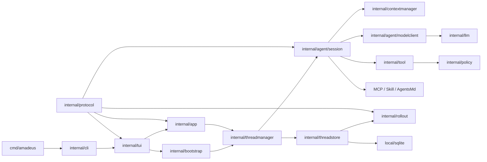

依赖关系可以这样理解：

- `protocol` 提供低层 Contract，供 Runtime、TUI 和 Adapter共同使用。
- `threadmanager` 创建和恢复 Session，并把 live Thread 暴露给上层。
- `threadstore` 保存 Thread 历史；`rollout` 定义可恢复的 canonical item。
- `tool` 定义通用 Tool 生命周期，`tool/builtin` 提供具体产品能力。
- `agent/session` 执行 Runtime 主链，Application 和 TUI通过它提交输入并接收事件。
- TUI 位于最上层，把 Application 与 Protocol事件投影为终端界面。

### 2.3 推荐阅读路径

| 修改目标 | 建议入口 |
|---|---|
| Agent 主循环 | `agent/session/session_loop.go` → `turn_start.go` → `continuation.go` |
| Prompt | `agent/session/step_capture.go` → `world_state.go` → `prompt_assembly.go` |
| Tool | `tool/execution_service.go` → `execution_batch.go` → `tool/builtin/*` |
| 文件修改 | `tool/builtin/read_file.go` → `edit_file.go` / `write_file.go` → `file_change.go` |
| Resume | `threadmanager/manager.go` → `threadstore/local` → `contextmanager/rollout_projection.go` |
| Multi-Agent | `agent/multiagent/control.go` → `lifecycle.go` → `threadmanager/agent_host.go` |
| TUI | `tui/application_update.go` → `application_events.go` → `history_*` |

## 3. 整体架构

### 3.1 核心原则

1. **唯一 Runtime 主链**：Default、Plan、Compaction 和 SubAgent 都复用 Session、Task、`runTurn`、ToolExecutionService 与 Rollout。
2. **单一事实 owner**：ThreadManager 管 live Thread；Session 管 ActiveTurn；`contextmanager.Manager`管模型history；ToolRouter管单次请求ToolSet。
3. **Typed Protocol**：跨 goroutine、跨层和需要恢复的事实使用 `Submission`、`EventMsg`、`TurnItem` 或 `RolloutItem`。
4. **Canonical Persistence**：JSONL 保存完整历史，SQLite提供可重建的 metadata index。
5. **Prompt 与能力一致**：模型 ToolSpec 与实际 dispatch 来自同一个 StepContext.ToolRouter。
6. **UI 负责 Projection**：TUI 将 Agent、Turn、Approval 和 Tool 事件转换为终端视图。
7. **取消路径明确**：goroutine、Process、Tool、Turn 和 child Thread 都沿着各自的 owner 传播取消，并在有限时间内完成清理。

### 3.2 分层架构

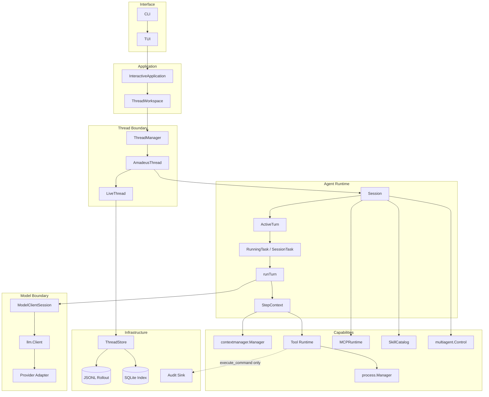

### 3.3 所有权树

学习 Runtime 时，先区分“谁拥有状态”和“谁只是使用快照”。下面的树只表达长期对象的主要所有权；缩进表示生命周期上的包含关系，不表示每个字段都是 Go struct 的直接字段。

```text
Amadeus process
├── ThreadManager
│   └── live Thread registry
│       ├── Root AmadeusThread
│       │   ├── Root Session
│       │   │   ├── SessionState
│       │   │   │   ├── Configuration
│       │   │   │   ├── BaseInstructions
│       │   │   │   └── ContextManager
│       │   │   │       └── canonical model history projection
│       │   │   ├── SessionServices
│       │   │   │   ├── Model client / ModelInfo
│       │   │   │   ├── Tool Registry / ToolExecutionService
│       │   │   │   ├── Approval / Permission context
│       │   │   │   ├── MCPRuntime / SkillCatalog / AgentsMdManager
│       │   │   │   └── ProcessManager / Web / Compaction services
│       │   │   ├── SessionIo
│       │   │   │   ├── Submission input boundary
│       │   │   │   ├── Event output boundary
│       │   │   │   └── Configured / Terminated lifecycle signals
│       │   │   └── ActiveTurn (最多一个)
│       │   │       ├── TurnContext
│       │   │       │   └── frozen model, mode, workspace and output policy
│       │   │       ├── RunningTask (最多一个)
│       │   │       │   └── SessionTask
│       │   │       │       ├── RegularTask → runTurn continuation loop
│       │   │       │       │   ├── StepContext (每次采样的不可变能力快照)
│       │   │       │       │   │   ├── Prompt / WorldState snapshot
│       │   │       │       │   │   └── ToolRouter snapshot
│       │   │       │       │   └── ModelClientSession (Turn 级流生命周期)
│       │   │       │       └── CompactTask → Session compaction lifecycle
│       │   │       └── TurnState
│       │   │           └── approval, user-input and same-turn waiters/queue
│       │   ├── Root AgentControl
│       │   │   └── shared with child Sessions in this Root tree
│       │   └── LiveThread
│       │       └── ThreadStore → JSONL Rollout + SQLite metadata index
│       └── Child AmadeusThread(s)
│           └── each has an independent Session / Turn / Rollout
```

这棵树可以用四个问题来阅读：

- **ThreadManager 拥有什么？** 它拥有 live Thread registry，负责创建、恢复、注册和关闭 `AmadeusThread`；它不拥有某个 Thread 的 Turn 或 Prompt history。
- **Session 拥有什么？** 它是一个模型 Agent 的长期执行 owner，串行管理 `SessionState`、`SessionServices`、`SessionIo`、`ActiveTurn` 和 terminal ordering。
- **ActiveTurn 拥有什么？** 它只代表当前一次 Turn，最多有一个 `RunningTask`；`RunningTask` 执行一个 `SessionTask`，并把完成结果交回 Session loop。
- **哪些对象不是长期 owner？** `TurnContext` 是 Turn 冻结值，`StepContext` 是一次模型采样的能力快照，`ToolRouter` 和 `ModelClientSession` 不能借此取得新的状态所有权。

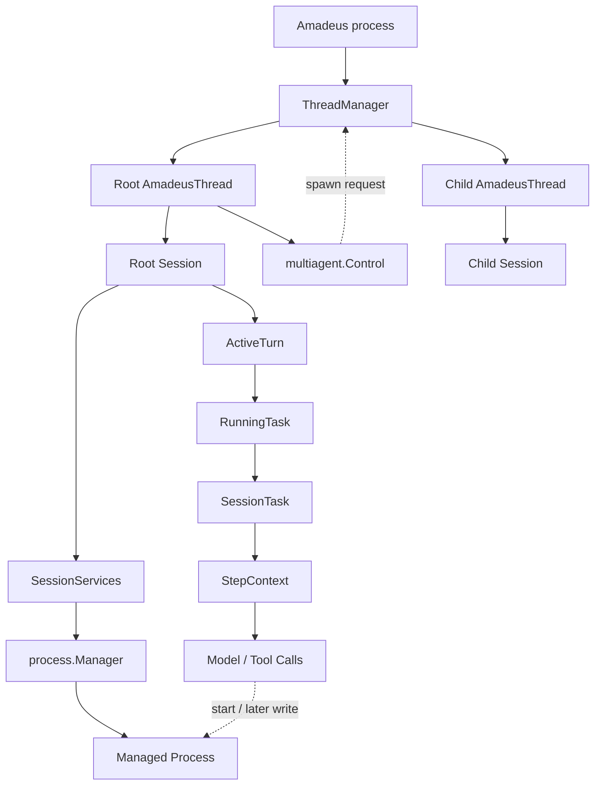

重要生命周期：

- 一个 Session 同时最多拥有一个 ActiveTurn。
- 一个 RunningTask 执行一个 SessionTask，并通过单值 Completion 返回 Session loop。
- SessionServices 在 Session 生命周期内复用 Provider、Tool、MCP、Skill、Permission 和 Process 等能力。
- StepContext对应一次模型采样及其紧随的 Tool dispatch。
- Root `multiagent.Control` 生命周期覆盖父 Turn；成功 spawn 的 child 拥有独立于父 Turn 的运行生命周期。

### 3.4 Core Runtime（概念层）

Codex 的 `codex-core` 是一个承载业务逻辑的 Rust crate；Amadeus 没有与之同名的总包，而是把同一组职责分散到多个 Go package。为了学习概念，可以把下面这棵树称为 **Core Runtime**。它是理解对象关系的视图，不表示需要新建 `internal/core` 目录。

```text
Core Runtime
├── Thread lifecycle
│   ├── ThreadManager          # 创建、恢复、注册和关闭 live Thread
│   └── AmadeusThread          # 对外提交/事件/查询句柄
├── Session execution
│   ├── Session                 # Submission loop 和终态顺序的唯一 owner
│   ├── SessionState            # 配置、BaseInstructions、ContextManager
│   └── SessionServices         # 跨 Turn 复用的 Agent capabilities
├── Turn execution
│   ├── ActiveTurn              # 当前 Turn（最多一个）
│   ├── RunningTask              # goroutine、取消和 Completion
│   ├── SessionTask              # RegularTask 或 CompactTask
│   ├── TurnContext              # Turn 级冻结配置
│   └── StepContext              # 单次采样的不可变能力快照
├── Capability boundaries
│   ├── contextmanager           # history、WorldState、token accounting
│   ├── agent/modelclient        # sampling、stream 和 reconnect
│   ├── tool / policy             # ToolRouter、执行和 Approval
│   └── MCP / Skill / AgentsMd   # Session-scoped 外部能力
└── Durability boundary
    ├── LiveThread / ThreadStore # canonical append 和恢复入口
    └── Rollout                  # 可恢复的 typed history facts
```

可以用以下映射把 Codex 的 crate 级概念定位到 Amadeus 的实际代码：

| Codex `codex-core` 概念 | Amadeus 实现 | 主要 owner |
|---|---|---|
| `ThreadManager` / `CodexThread` | `internal/threadmanager` | Thread 创建、恢复、registry 和对外句柄 |
| `core::session` + private `state` | `internal/agent/session` | Session loop、状态、Turn 和 Task |
| `context_manager` | `internal/contextmanager` | canonical model history、Prompt snapshot 和 token accounting |
| `client` / `ModelClientSession` | `internal/agent/modelclient` + `internal/llm` | Provider-neutral request、stream 和 retry |
| `tools` / approval | `internal/tool` + `internal/policy` + `internal/tool/builtin` | Tool snapshot、执行生命周期和权限决定 |
| `rollout` / `thread-store` | `internal/rollout` + `internal/threadstore` | durable history、LiveThread 和 metadata index |

这里有三个容易混淆的边界：

- **Bootstrap 不是 Core Runtime。** Bootstrap 解析环境、打开 Store、创建 adapters 和 `ThreadManager`；它负责“把运行时组装起来”，不拥有 Turn、Prompt history 或模型循环。
- **Application/TUI 不是 Core Runtime。** `ThreadWorkspace` 只选择当前 Thread，`InteractiveApplication` 和 TUI 只提交输入、消费 Event 并做 projection；它们不判断 Turn 完成，也不直接执行 Tool。
- **`CoreRegistry` 不是 Codex Core。** `internal/tool/builtin.CoreRegistry` 只是内置 Tool 的注册表，属于 Capability boundary，不是 Session 或 Thread 的运行时总 owner。

Core Runtime 中常用的基数关系如下：

```text
一个 Workspace runtime
└── 一个 ThreadManager
    └── 0..N 个 live AmadeusThread
        └── 一个 Session
            ├── 一个 SessionState
            ├── 一个 SessionServices
            └── 0..1 个 ActiveTurn
                └── 0..1 个 RunningTask
                    └── 一个 SessionTask
                        └── RegularTask 的 runTurn 可执行多个 StepContext
                            └── 每个 StepContext 可产生 0..N 个 Tool calls
```

树中的关系应这样解释：`owns` 表示生命周期和关闭责任，`uses` 表示调用另一个 owner 的能力，`snapshot` 表示只读的请求快照，`emits` 表示通过 `Event/EventMsg` 输出，`persists` 表示写入 canonical Rollout。一个对象即使持有另一个对象的指针，也不因此取得后者的事实所有权。

## 4. 端到端运行主链

### 4.1 从用户输入到 Turn 终态

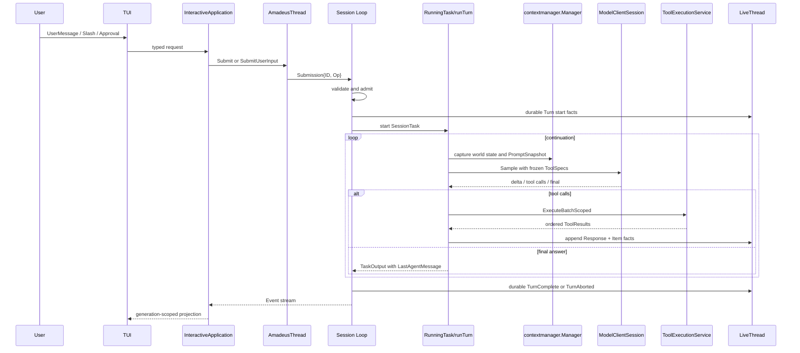

### 4.2 Session Loop

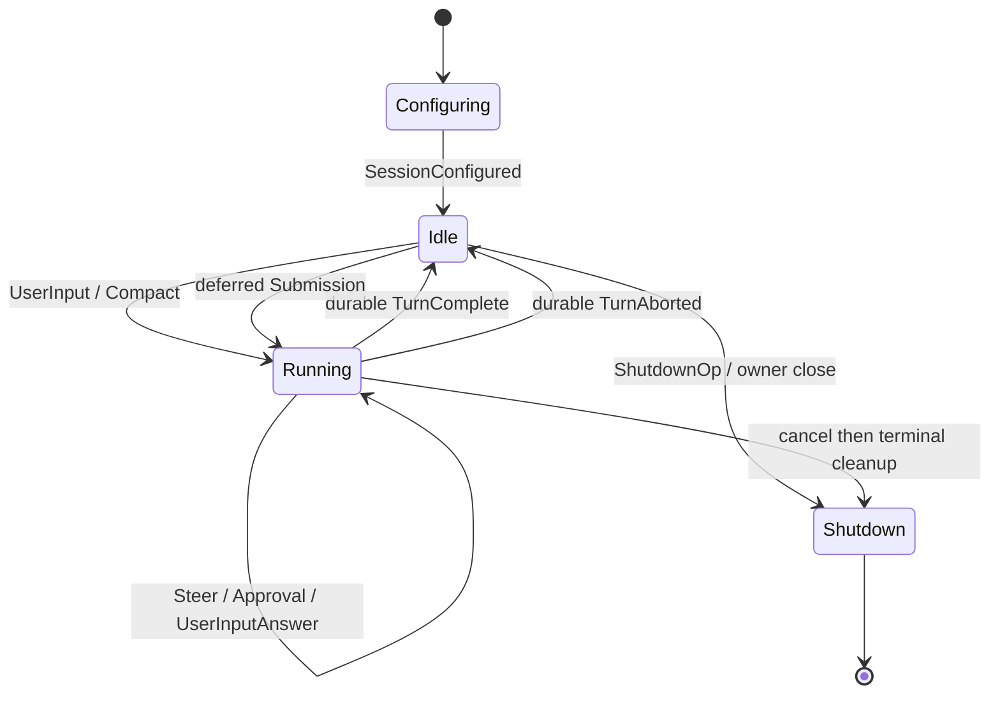

Session loop 串行拥有：

- 当前 Configuration、ActiveTurn 和 deferred submissions。
- Approval 与 `request_user_input` waiter。
- same-turn InputQueue admission。
- terminal append、flush、ActiveTurn cleanup 和终态 Event 顺序。

### 4.3 核心运行模型

| 模型 | 职责 |
|---|---|
| `Submission` | Interface/Application 到 Session 的输入 envelope。 |
| `Event` / `EventMsg` | Session 到消费方的 typed 输出。 |
| `TurnContext` | Turn 开始时冻结的模型、CWD、Mode、reasoning 与输出约束。 |
| `StepContext` | 每次采样冻结的 ToolRouter、ModelInfo、AGENTS/Skill/Permission/SubAgent snapshots。 |
| `TaskOutput` | SessionTask 返回的 outcome、reason、Tool count 和 optional LastAgentMessage。 |
| `TurnCompleteEvent` | durable terminal authority；直接携带 optional LastAgentMessage。 |
| `TurnItem` | live TUI 与 Resume 共用的业务展示单元。 |

## 5. Protocol 与 Canonical Facts

### 5.1 目录

```text
internal/protocol/
├── identity/                 # typed IDs
├── submission.go            # Op input family
├── event.go                 # Event envelope
├── session_events.go        # Session configuration/lifecycle
├── turn_events.go           # Turn terminal and stream errors
├── items.go                 # TurnItem and deltas
├── approval.go              # Approval request/decision DTO
├── request_user_input.go    # structured question/answer DTO
├── collaboration*.go        # Plan and Multi-Agent protocol
└── codec.go / scope.go      # durable encoding and scope helpers
```

### 5.2 协议层次

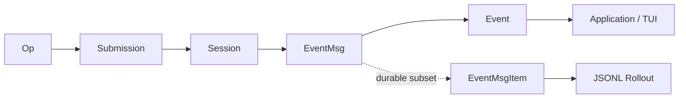

协议分工：

- `Op` 表达 UserInput、Compact、Interrupt、Shutdown、Settings 和交互回答。
- `EventMsg` 表达 Session/Turn/Item 生命周期、Token、Warning、Error 和交互请求。
- Delta 用于 live 展示；completed item 携带恢复所需的完整事实。
- Approval/UserInput request、Working、Popup 和动画属于运行时交互状态，canonical history保存完成后的业务事实。

`TurnItem` 的稳定 payload 由 `Kind` 决定，而不是一个可以任意扩展的 JSON 对象：`tool_call`、`command_execution`、`file_change` 和 `context_compaction` 必须分别携带对应的 typed payload，并校验 Item 的 identity、status 和时间字段。缺少 payload 或 payload 类型不匹配的记录属于当前格式错误；解码器不会用旧格式默认值或 `map[string]any` 补齐。只有 codec envelope 使用 `RawMessage`，ToolResult 的 `Data/Metadata` 才作为明确的不透明外部扩展在 projection 边界消费。

### 5.3 Identity

| Identity | 职责 |
|---|---|
| `SessionID` | Root 与 child tree-level correlation；Root 与 Root ThreadID 使用同一 UUID value。 |
| `ThreadID` | 具体 Thread、Rollout、registry 和 Resume identity；新值使用 UUIDv7。 |
| `TurnID` | 一个 Session Turn。 |
| `SubmissionID` | 输入与输出 Event correlation。 |
| `RequestID` | Approval 或 structured user input waiter。 |
| `ItemID` | Assistant、Tool、Plan、Collaboration item。 |

## 6. 配置与 Bootstrap

### 6.1 目录

```text
cmd/amadeus/main.go
internal/cli/
internal/config/
internal/bootstrap/
```

### 6.2 配置装配流程

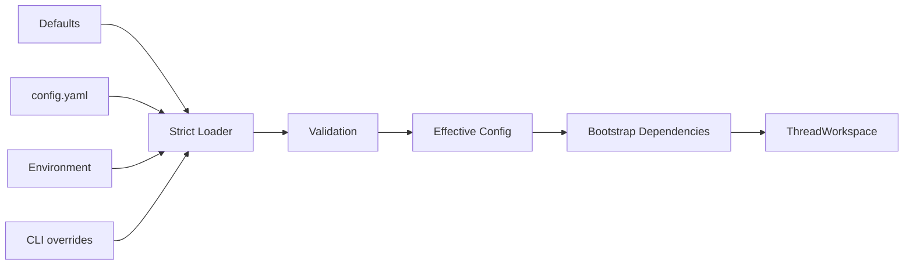

配置与装配行为：

- 用户配置采用 versionless strict schema；未知字段会在加载阶段报告错误。
- 优先级为 defaults → file → environment → CLI。
- Bootstrap 创建具体 Provider factory、ThreadStore、Audit、Web/MCP dependencies 和 ThreadManager。
- Bootstrap 以明确的 typed dependencies 组装 Runtime 所需服务。

### 6.3 重要模型职责

| 模型 | 职责 |
|---|---|
| `config.Config` | 当前有效配置聚合。 |
| `ModelProviderInfo` | Provider transport、Dialect、凭据、timeout/retry。 |
| `AgentConfig` / `MultiAgentConfig` | Tool 并发与 Basic Multi-Agent 限制。 |
| `Sources` | 配置字段 provenance。 |
| `session.Configuration` | 注入 Session 的冻结配置与 workspace facts。 |
| `ServiceAdapters` | Bootstrap 到 Session 的 concrete adapter factories。 |

## 7. Thread、Rollout 与持久化

### 7.1 目录

```text
internal/threadmanager/
├── manager.go               # registry and root lifecycle
├── amadeus_thread.go        # external runtime handle
├── agent_host.go            # child spawn/edge/notification host
└── child_resume.go          # open child reconstruction

internal/threadstore/
├── live.go                  # concurrent writer handle
├── store.go                 # persistence port
└── local/
    ├── writer.go            # append and flush
    ├── metadata.go          # metadata projection
    ├── index.go             # rebuild
    └── sqlite/              # metadata adapter

internal/rollout/
├── codec.go
├── recorder.go
├── items.go
└── agent_edge.go
```

### 7.2 两种持久化事实

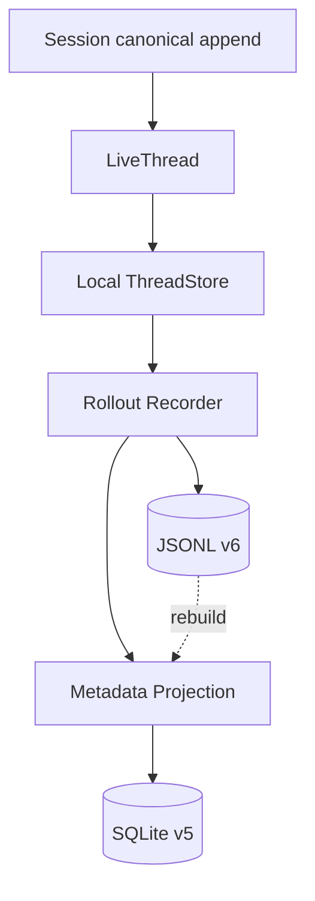

- JSONL Rollout 是完整 durable truth。
- SQLite 保存 Thread metadata、parent relation、token totals 和可重建 agent edge state。
- SQLite 按 durable watermark 投影 JSONL，并作为可重建的 metadata read model。
- 当前 Rollout v6、SQLite schema v5；存储层按当前格式读取和校验，旧开发格式由版本检查报告为不兼容。
- 当前开发阶段不提供针对旧 Rollout、旧 SQLite 或旧 payload 的兼容 reader、migration、alias 或 fallback decoder；测试数据应按当前 schema 直接重建。`CatalogMigration`/`CatalogPlanned` 等未实现能力状态也不属于当前 Tool Catalog。

### 7.3 写入顺序

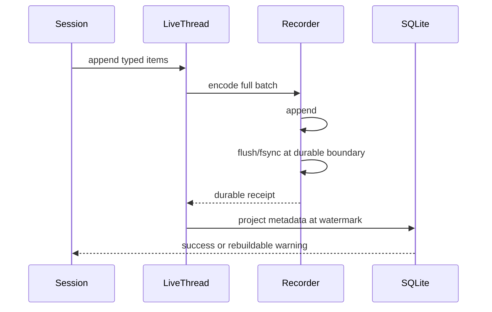

### 7.4 重要模型职责

| 模型 | 职责 |
|---|---|
| `AmadeusThread` | 对外 Thread handle；提交 Op、消费 Event、查询 history。 |
| `ThreadManager` | 唯一 live registry；创建/恢复 Root 与 child Session。 |
| `LiveThread` | 单 Thread writer 的并发安全边界。 |
| `ThreadStore` | materialize、append、load、list、archive、rebuild port。 |
| `RolloutItem` | canonical typed item family。 |
| `SessionMetaItem` | Thread 创建、SessionID、source、Base provenance。 |
| `ResponseItem` | 模型可见 User/Assistant/Tool facts。 |
| `WorldStateItem` / `TurnContextItem` | Prompt baseline 与 Turn reference。 |
| `CompactedItem` | compaction replacement checkpoint。 |
| `AgentSpawnEdgeItem` | Root rollout 中 Basic Multi-Agent open/closed membership。 |
| `StoredThread` | SQLite metadata read model，提供Thread索引与展示信息。 |

学习时可以把 `TurnItem` 理解为“可重放的 typed 展示事实”：先由 `Kind` 选择 payload variant，再由 live Event 和 Resume projection 共同消费；TUI 不从展示文本猜测 Tool 身份，也不从旧 JSON 形状推断缺失字段。

## 8. Agent Loop

### 8.1 目录

```text
internal/agent/session/
├── session.go / session_loop.go
├── submission.go / turn_start.go / turn_completion.go
├── task.go / regular_task.go / compact_task.go
├── running_task.go / turn_state.go / input_queue.go
├── run_turn.go / continuation.go / turn_budget.go
├── step_context.go / step_capture.go
├── model_completion.go / tool_events.go
└── compaction.go / context_window.go
```

### 8.2 Turn 启动与终止

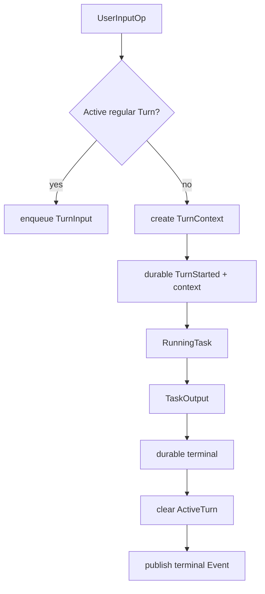

Terminal 顺序是：RunningTask 返回 → canonical append/flush → 清理 ActiveTurn → 发布 TurnComplete/TurnAborted。

### 8.3 Continuation Loop

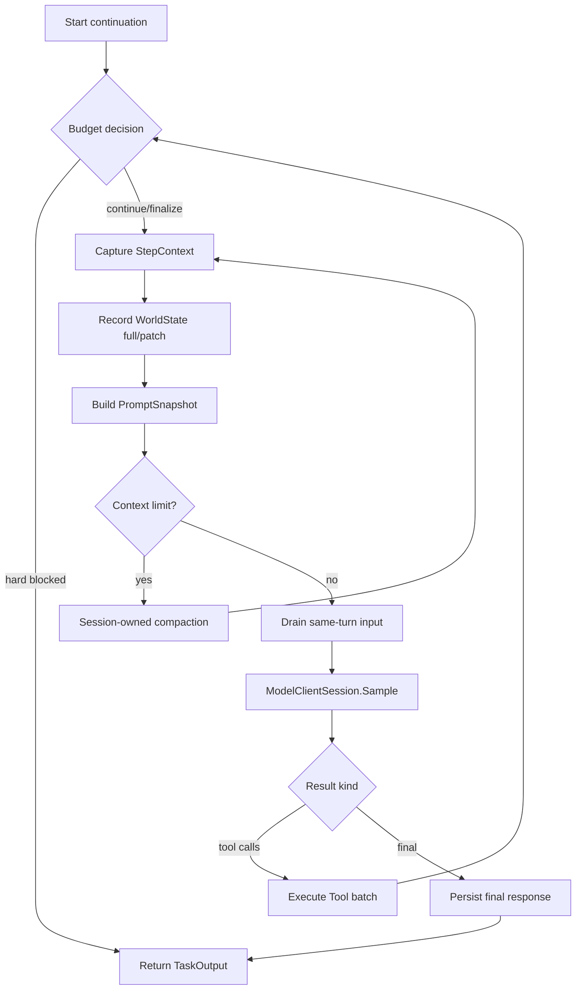

Basic SubAgent 在 soft budget boundary 进入一次 Tools 为空的 finalization sample；hard limit或 finalization failure形成带 reason 的 blocked outcome。

### 8.4 同 Turn 输入与下一 Turn Queue

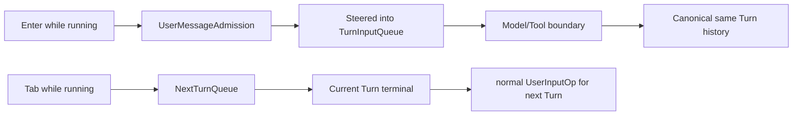

Enter steer 是 Runtime fact；Tab queue 在提交前属于 TUI attachment，提交后才转换为下一 Turn 的普通输入。

### 8.5 Collaboration Mode 与 Runtime Coordination

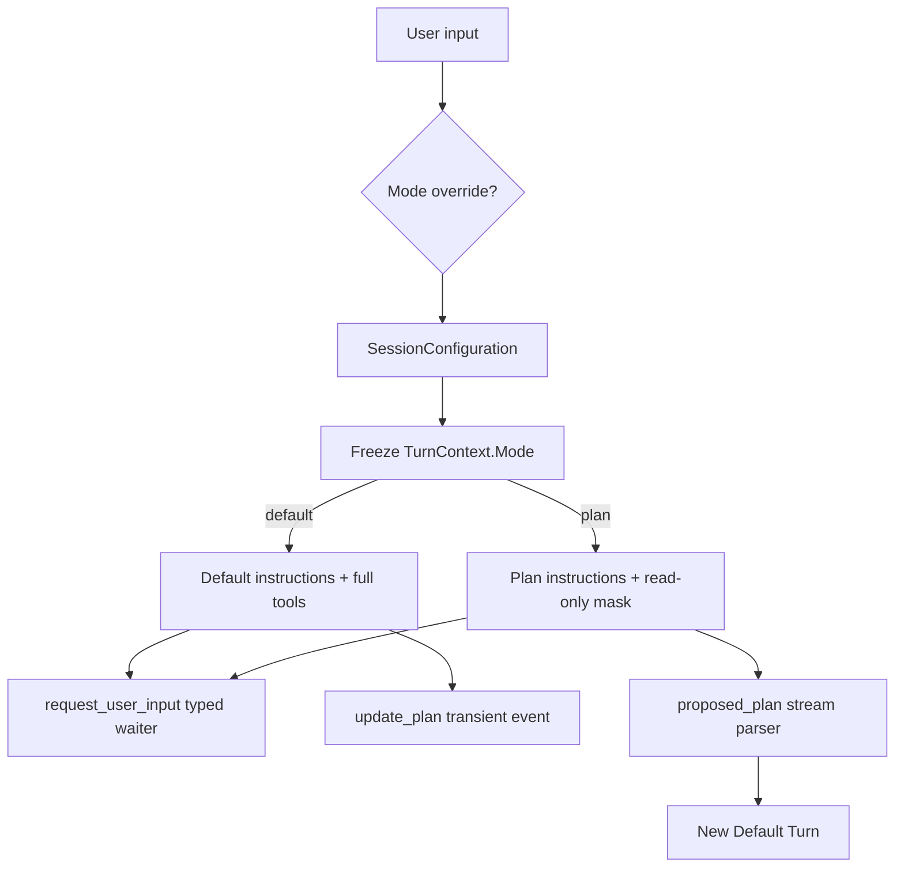

- Default和Plan通过Prompt与ToolRouter policy表达差异，共享同一套Task和Agent Loop。
- `update_plan`是Default中的transient checklist Tool，运行时以事件形式更新界面。
- `request_user_input`在两种mode中使用同一typed Event/Answer/waiter链，与Approval分开处理。
- Plan Mode的正式方案由`<proposed_plan>` parser产生PlanDelta和completed PlanItem；实施通过后续Default UserInputOp开始。

### 8.6 重要模型职责

| 模型 | 职责 |
|---|---|
| `Session` | Session loop、configuration、services、active/deferred state owner。 |
| `SessionServices` | Session-scoped Provider、Tool、MCP、Skill、Permission 等 capability。 |
| `ActiveTurn` | 当前 submission、RunningTask、TurnState 和累计 TaskOutput。 |
| `RunningTask` | goroutine、cancel cause、completion channel。 |
| `SessionTask` | Regular/Compact workflow contract。 |
| `TurnState` | pending interactive requests 和 same-turn input。 |
| `TurnBudget` | sample/tool/time soft/hard limits。 |
| `TaskOutput` | outcome、reason、LastAgentMessage、Tool count。 |

## 9. Prompt、Context 与 AGENTS.md

### 9.1 目录

```text
internal/prompt/
├── model_messages.go
├── collaboration.go
├── compaction.go
├── source_manifest.go
└── builtin/templates/

internal/contextmanager/
├── manager.go / history.go
├── rollout_projection.go / output_projection.go
├── world_state.go / prompt_snapshot.go
├── token.go / tool_result.go
└── subagent_notification.go

internal/agentsmd/
└── document.go / manager.go
```

### 9.2 Prompt 分层

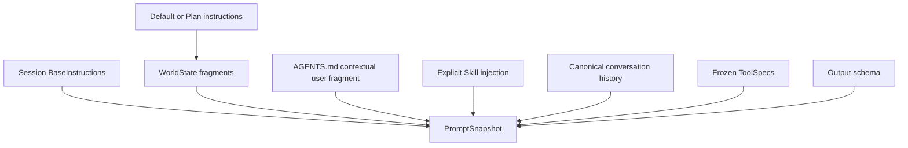

BaseInstructions 在 Thread 创建时解析并持久化 exact text + provenance；Resume 使用这份稳定文本，即使内置模板随后升级。

`PromptSnapshot.Items`保存由`contextmanager.Manager`规范化后的canonical history。BaseInstructions、ToolSpecs、parallel flag和output schema由`llm.Prompt`单独提供，同时参与input estimate与Prompt revision，并与Items一起进入Provider request。

### 9.3 Step Prompt 构造

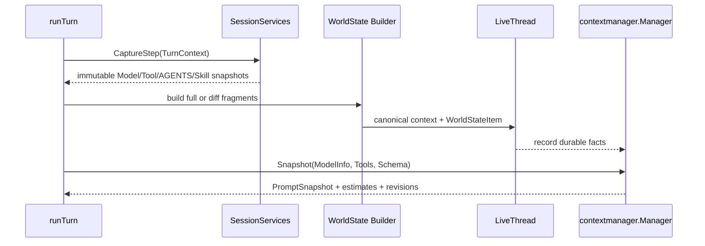

记录 WorldState 后才构造 PromptSnapshot，保证模型请求、token estimate 和 Resume 使用同一 history watermark。

### 9.4 WorldState

WorldState 使用 stable section ID 和 Absent/Unknown/Known baseline：

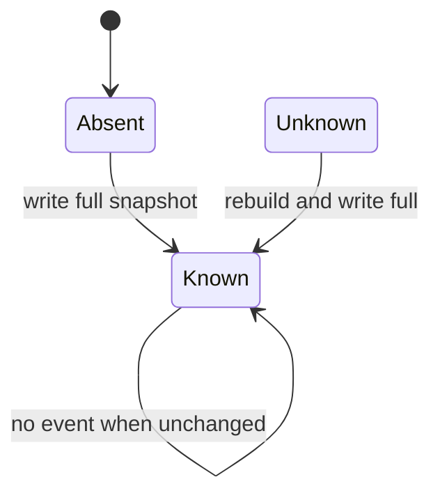

主要 section 包括 model、personality、collaboration mode、environment、permissions、AGENTS.md、Skill catalog 和 Multi-Agent role/status。

### 9.5 AGENTS.md 与 Skill Prompt 边界

- AGENTS.md 按目标路径解析层级和作用域，作为 contextual user fragment进入 canonical history。
- Tool target进入新目录时，AGENTS.md manager会重新计算该路径生效的指令。
- Skill catalog metadata属于 WorldState；显式 `$skill-name` 会把正文作为 `<skill>` user fragment注入。
- Tool guidance由ToolSpec提供，并在同一份StepContext中与实际handler绑定。

### 9.6 Token 与 Compaction

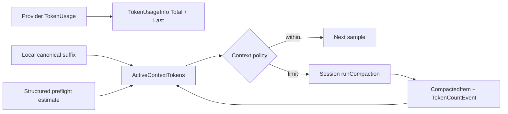

CompactionService生成typed output；Session负责trigger、source validation、usage、atomic install、Context mutation和Item terminal。

### 9.7 重要模型职责

| 模型 | 职责 |
|---|---|
| `BaseInstructions` | exact stable base text 与 provenance。 |
| `ModelMessages` | model/mode/multi-agent instruction catalog。 |
| `ContextFragment` | 带role、kind和separate语义的模型可见片段。 |
| `WorldStateItem` | durable full/patch baseline。 |
| `PromptSnapshot` | immutable request history、estimate与revision。 |
| `TokenUsageInfo` | Thread cumulative usage和last request usage。 |
| `ContextWindowTokenStatus` | active context policy decision。 |
| `compact.Source` / `compact.Output` | 无状态摘要输入与typed结果。 |

## 10. LLM Domain 与 Provider

### 10.1 目录

```text
internal/llm/                  # domain port and model
internal/llm/openai/           # Responses / Chat adapters
internal/agent/modelclient/    # turn-scoped stream lifecycle
```

### 10.2 边界

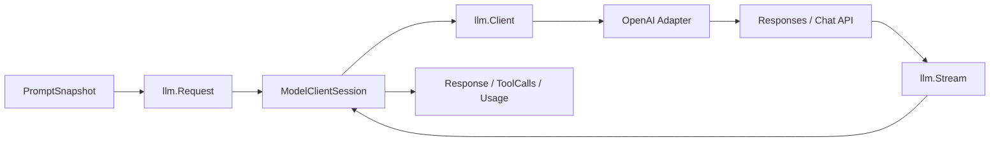

- `llm` 使用Provider-neutral model；OpenAI SDK wire model由`llm/openai` adapter承载。
- Adapter 负责 request mapping、dialect差异、request retry和error normalization。
- ModelClientSession负责response stream reconnect、idle timeout、attempt reset和typed transient StreamErrorEvent。
- Responses把Base放在wire `instructions`；Chat Completions按Dialect生成唯一system前缀。

### 10.3 Request Retry 与 Stream Reconnect

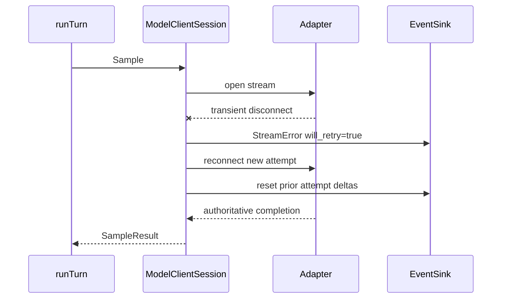

### 10.4 重要模型职责

| 模型 | 职责 |
|---|---|
| `ModelInfo` | context window、modalities、parallel tools、output limits。 |
| `llm.Prompt` | Base、input items、ToolSpecs、output schema。 |
| `llm.Request` | Provider-neutral sampling request。 |
| `llm.Response` | message、finish reason、usage。 |
| `ProviderError` | normalized provider failure classification。 |
| `ModelClientSession` | Turn-scoped stream recovery owner。 |

## 11. Tool 架构

### 11.1 目录

```text
internal/tool/
├── tool.go                    # ToolDefinition contract
├── registry.go / router.go    # registration and request snapshot
├── validation.go              # schema normalization
├── execution_service.go       # single call lifecycle
├── execution_batch.go         # bounded concurrency and order restore
├── execution_outcome.go       # typed result mapping
└── builtin/                   # concrete tools
```

### 11.2 外层与内层来源

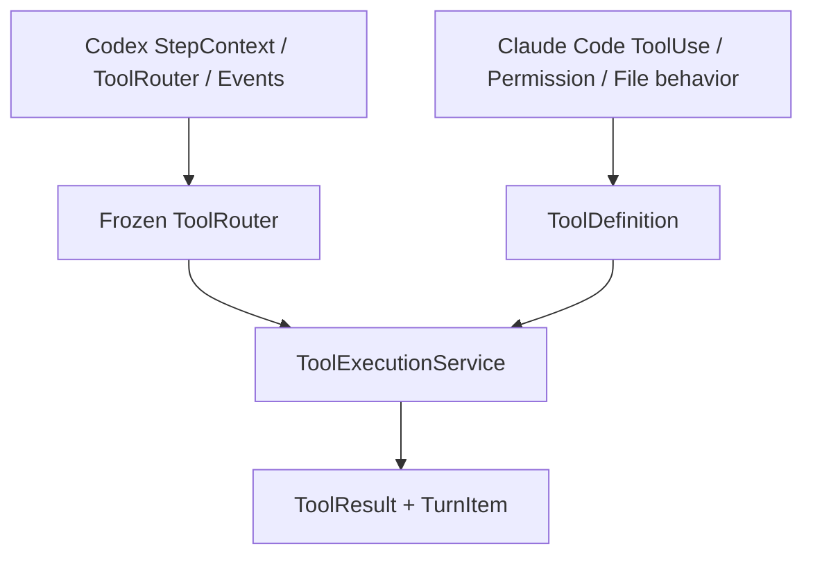

Codex决定单次请求看到哪些Tool、如何dispatch和如何进入Event/Rollout；Claude Code决定Tool内部的validate/prepare/permission/execute以及文件工具安全语义。

### 11.3 Tool 调用链

```mermaid
flowchart LR
    Call[Model ToolCall]
    Route[Resolve frozen route]
    Normalize[Normalize schema input]
    Validate[ValidateInput]
    Prepare[Prepare side-effect-free state]
    Observe[Observe target instructions]
    Permission[Permission Evaluate]
    Approval[Approval if Ask]
    Execute[Execute prepared state]
    Result[Typed ToolResult]
    Persist[ResponseItem + TurnItem]

    Call --> Route --> Normalize --> Validate --> Prepare --> Observe --> Permission
    Permission -->|Allow| Execute
    Permission -->|Ask| Approval --> Execute
    Permission -->|Deny| Result
    Execute --> Result --> Persist
```

`PreparedToolUse` 是 Prepare、Approval 和 Execute 间的不可变handoff；Runtime沿用这份准备态完成后续执行。

### 11.4 Batch 并发

```mermaid
flowchart TD
    Batch[Tool call batch]
    NormalizeAll[normalize and record all calls]
    Groups[partition serial / parallel runs]
    Workers[bounded workers]
    Collect[indexed results]
    Sort[restore model order]
    Publish[ordered completed events]

    Batch --> NormalizeAll --> Groups
    Groups --> Workers --> Collect --> Sort --> Publish
```

Tool声明parallel-safe时进入有界并发；完成结果按模型调用顺序恢复。

### 11.5 内置 Tool 分组

| 分组 | Tool | 关键边界 |
|---|---|---|
| 文件读取 | `read` | canonical path、bounded lines、complete-read state |
| 搜索 | `glob`、`grep` | stable order、result/token bounds |
| 文件修改 | `edit`、`write` | Diff、Approval、stale revalidate、atomic apply |
| 进程 | `execute_command`、`write_stdin` | exact command grant、`process.Manager` |
| Runtime | `update_plan`、`request_user_input` | dedicated Event / typed waiter |
| 外部 | Web、MCP、Skill、image | capability-specific validation |
| 协作 | spawn/send/wait/close | root-only `multiagent.Control` |

### 11.6 重要模型职责

| 模型 | 职责 |
|---|---|
| `ToolSpec` | 模型可见name、description、schema、side effect和visibility。 |
| `ToolRouter` | 一次Step的spec+handler identity snapshot。 |
| `ToolUseContext` | invocation identity、permission、file state、interaction ports。 |
| `PreparedToolUse` | side-effect-free prepared input/state/permission request。 |
| `ToolResult` | 模型可见text/parts/data/error/partial。 |
| `ToolDisplayResult` | TUI和Event安全投影。 |
| `ToolExecution` | call、outcome、duration和result。 |

## 12. Permission、Approval 与文件修改

### 12.1 模块关系

```mermaid
flowchart TB
    Tool[Tool Prepare]
    FS[FileSystemPolicy]
    Permission[PermissionService]
    Grants[SessionPermissionContext]
    Coordinator[ApprovalCoordinator]
    Event[ApprovalRequestEvent]
    TUI[Approval Dialog]
    Decision[ApprovalDecisionOp]
    Execute[Tool Execute]

    Tool --> FS
    Tool --> Permission
    Permission --> Grants
    Permission -->|Ask| Coordinator --> Event --> TUI --> Decision --> Coordinator
    Permission --> Execute
    Coordinator --> Execute
```

### 12.2 文件修改流程

```mermaid
flowchart LR
    Read[Complete read]
    State[FileReadState]
    Prepare[Prepare edit/write]
    Diff[Structured Diff]
    Ask[Approval]
    Reopen[Re-read file]
    Stale{Hash/mode/symlink match?}
    Apply[Atomic apply]
    Verify[Verify result]

    Read --> State --> Prepare --> Diff --> Ask --> Reopen --> Stale
    Stale -->|yes| Apply --> Verify
    Stale -->|no| Conflict[stale/conflict result]
```

文件修改的处理顺序：

- 已有文件先记录完整读取状态，再进入edit/write。
- Preview和Apply共享prepared state；Approval等待后重新校验文件状态。
- Session grant按read/edit/command/external能力隔离，并随Session生命周期保存于内存中。
- 文件系统Denied/ReadOnly/symlink规则由FileSystemPolicy持续执行，grant在该策略内生效。

### 12.3 重要模型职责

| 模型 | 职责 |
|---|---|
| `tool.PermissionEvaluation` | Allow/Ask/Deny和最小grant建议。 |
| `policy.SessionPermissionContext` | 当前Session内存grant。 |
| `policy.ApprovalRequest` / `ApprovalPresentation` | Tool生成的typed交互内容与选项。 |
| `policy.ApprovalDecision` | 用户选择、scope、source和reason。 |
| `tool.FileReadState` | path、exists、hash、mode、symlink和read coverage。 |
| `filechange.Preview` | operation、before/after hash、stats、hunks。 |
| `filechange.Result` | apply后的typed事实。 |

## 13. Command 与 Process

### 13.1 目录

```text
internal/tool/builtin/execute_command*.go
internal/tool/builtin/write_stdin.go
internal/process/
internal/policy/command_guard.go
```

### 13.2 执行流程

```mermaid
flowchart LR
    Input[command/cwd/timeout/tty]
    Validate[Validate]
    Guard[Dangerous command guard]
    Permission[Exact command permission]
    Approval[Approval if needed]
    Start[process.Manager.Start]
    Stream[bounded stdout/stderr]
    Continue[write_stdin / poll / close]
    Result[ProcessResult]

    Input --> Validate --> Guard --> Permission
    Permission --> Approval --> Start
    Permission --> Start
    Start --> Stream --> Result
    Start --> Continue --> Result
```

Amadeus在宿主系统执行命令；命令安全行为由默认Ask、灾难性命令拒绝、exact command grant、timeout、process cancellation和输出上限组成，Unix非PTY命令额外按process group终止。

### 13.3 重要模型职责

| 模型 | 职责 |
|---|---|
| `process.Manager` | process registry、按进程串行化I/O、cancel和Session cleanup。 |
| `process.Command` | executable/shell、CWD、timeout、TTY、output bound与调用归属。 |
| `process.Snapshot` | Manager返回的运行状态、output、exit code与truncation。 |
| `builtin.ProcessResult` | `execute_command` / `write_stdin`向ToolResult和TUI公开的稳定投影。 |
| `policy.CommandApprovalKey` | canonical CWD + minimally normalized exact command grant key。 |
| `process.Command.OriginCallID` | `write_stdin`校验并继承原`execute_command`调用归属。 |

## 14. MCP

### 14.1 目录

```text
internal/mcp/
├── config.go
├── runtime*.go              # connection lifecycle and snapshots
├── binding.go               # immutable request-facing binding
├── catalogs.go              # Tool/Resource metadata
├── lazy_tool.go             # list/call deferred tools
├── resource_tool.go
└── client*.go               # stdio / HTTP clients
```

### 14.2 架构

```mermaid
flowchart TB
    Config[MCP Config]
    Runtime[MCPRuntime]
    Connections[Server Connections]
    Tools[ToolCatalog]
    Resources[ResourceCatalog]
    Binding[MCPBinding revision]
    Step[StepContext]
    Router[ToolRouter]
    Execute[ToolExecutionService]

    Config --> Runtime --> Connections
    Connections --> Tools
    Connections --> Resources
    Tools --> Binding
    Resources --> Binding
    Binding --> Step --> Router --> Execute
```

### 14.3 Lifecycle

```mermaid
stateDiagram-v2
    [*] --> Configured
    Configured --> Starting: first catalog/resource request
    Starting --> Connected: initialize success
    Starting --> Failed: startup failure
    Connected --> Refreshing: explicit refresh
    Refreshing --> Connected: new binding revision
    Connected --> Disconnected: transport failure
    Disconnected --> Starting: retry once / next demand
    Connected --> Closed: Session close
    Failed --> Closed: Session close
```

MCP运行行为：

- MCPRuntime是Session-scoped connection owner。
- 每个server由独立`serverState` mutex串行化catalog、call、refresh和reconnect；不同server使用各自的锁。
- StepContext捕获MCPBinding revision；当前Step的spec和dispatch identity保持一致。
- `mcp_list_tools`、`mcp_call`、`mcp_list_resources`和`mcp_read_resource`都进入普通Tool pipeline。
- 非只读 MCP call默认需要Approval；只读远程工具与resource list/read按只读策略处理。
- MCP结果带有server/tool来源并经过bounded处理，供模型作为外部数据阅读。

### 14.4 重要模型职责

| 模型 | 职责 |
|---|---|
| `MCPRuntime` | connection、catalog refresh、shutdown owner。 |
| `MCPBinding` | server generation和catalog revision的immutable snapshot。 |
| `ToolCatalog` / `ResourceCatalog` | sanitized remote capability metadata。 |
| `LazyListTool` / `LazyCallTool` | 延迟发现与调用remote Tool的`ToolDefinition`适配。 |
| `ListResourcesTool` / `ReadResourceTool` | remote Resource的发现与读取适配。 |
| `mcp.Config` / `ServerConfig` | stdio或streamable HTTP server配置。 |

## 15. Skill

### 15.1 目录

```text
internal/skill/
├── discovery.go / parser.go
├── catalog.go / revision.go
├── selection.go / settings.go
├── injection.go / invocation.go
└── resources.go
```

### 15.2 发现与注入流程

```mermaid
flowchart LR
    Roots[User + project skill roots]
    Discover[Discover SKILL.md]
    Parse[Parse metadata]
    Catalog[SkillCatalog + revision]
    World[WorldState metadata index]
    Prompt[User input contains $skill-name]
    Select[ResolveExplicit]
    Inject[Canonical SkillInjection]
    Resource[read_skill references]

    Roots --> Discover --> Parse --> Catalog --> World
    Prompt --> Select --> Inject
    Catalog --> Select
    Inject --> Resource
```

Skill采用渐进式披露：默认把metadata/index提供给模型；用户输入显式包含`$skill-name`时注入完整SKILL.md；模型也可通过`read_skill`按需读取Skill正文或`references/`文件。Skill script由`execute_command`执行，并沿用命令工具的权限和进程生命周期。

### 15.3 重要模型职责

| 模型 | 职责 |
|---|---|
| `SkillMetadata` | name、description、location和可用性。 |
| `SkillCatalog` | discovery、dedupe、settings和revision owner。 |
| `SkillInjection` | canonical模型可见Skill正文。 |
| `SkillDocument` | 已重新读取并校验的metadata、root与SKILL.md正文。 |
| `SkillResource` | reference、script或asset的相对路径、大小与revision。 |
| `ScriptInvocation` | `execute_command`识别出的Skill script及其attribution。 |
| `ReadSkill` | 对Skill正文与`references/`执行revision校验和有界读取。 |

## 16. Web 与图片

### 16.1 Web

```mermaid
flowchart LR
    SearchTool[web_search]
    Provider[Search Provider]
    Results[bounded evidence snippets]
    FetchTool[web_fetch]
    URL[URL validation]
    DNS[Pinned DNS/dial]
    Redirect[Redirect policy]
    Body[bounded body]
    Markdown[Readable Markdown]

    SearchTool --> Provider --> Results
    FetchTool --> URL --> DNS --> Redirect --> Body --> Markdown
```

Web Search与Fetch分离：Search返回证据线索，Fetch读取完整页面。URL scheme、credentials、DNS结果、redirect目标、content type、bytes和timeout都在Tool边界验证。

### 16.2 图片

```mermaid
flowchart LR
    View[view_image]
    Path[Path + Permission]
    Read[bounded file read]
    Decode[decode and detect format]
    Prepare[resize/re-encode/detail budget]
    Part[ToolResult image part]
    Provider[Provider modality mapping]

    View --> Path --> Read --> Decode --> Prepare --> Part --> Provider
```

图片Base64在canonical ResponseToolResult中保存一次；completed Event/TUI保存display-safe metadata。`contextmanager.Manager`按prepared dimensions/detail估算成本，ToolRouter根据模型能力决定`view_image`是否可见。

### 16.3 重要模型职责

| 模型 | 职责 |
|---|---|
| `websearch.Result` | title、URL、snippet。 |
| `websearch.Service` | provider、timeout、result bounds。 |
| `webfetch.Document` | final URL、type、title、Markdown、partial。 |
| `PreparedImage` | source/prepared dimensions、MIME、bytes、detail、payload。 |
| `PreparationLimits` | dimension、pixel和patch budget。 |

## 17. Basic Multi-Agent

### 17.1 目录

```text
internal/agent/multiagent/
├── control.go               # spawn/send/wait/close API
├── reservation.go           # slot and nickname transaction
├── lifecycle.go             # live/Resume pure reducer
├── status.go                # event consumer and notification delivery
├── shutdown.go              # explicit close vs unload
└── message_budget.go        # parent notification token bounds

internal/threadmanager/
├── agent_host.go            # spawn/edge/notification host
└── child_resume.go          # open child restore
```

### 17.2 架构

```mermaid
flowchart TB
    Root[Root Thread]
    Tools[spawn / send / wait / close]
    Control[multiagent.Control]
    Host[ThreadManager AgentHost]
    Edge[Root AgentSpawnEdgeItem]
    Child[Child Thread + Session]
    Router[Read-only ToolRouter]
    Events[Child Events]
    Reducer[AgentStatus + LastTurn reducer]
    Notify[Typed ContextFragment]
    Parent[Root Context]

    Root --> Tools --> Control
    Control --> Host --> Child
    Control --> Edge
    Child --> Router
    Child --> Events --> Reducer --> Notify --> Parent
```

### 17.3 Spawn 与生命周期

```mermaid
sequenceDiagram
    participant Tool as spawn_agent
    participant C as multiagent.Control
    participant H as ThreadManager
    participant Child as Child Session
    participant Root as Root Session/Rollout

    Tool->>C: Spawn(message)
    C->>C: reserve slot + nickname
    C->>H: SpawnChild
    H->>Child: create full Thread/Session
    C->>Child: initial UserInput admission
    C->>Root: durable edge open
    C->>C: commit reservation
    C-->>Tool: agent ID + nickname
```

成功spawn后child绑定root tree，独立运行自己的Session和Turn。父Turn结束后child继续运行；Root/Application shutdown会卸载child runtime，explicit close先持久化closed edge。

`blocked`是`AgentTurnResult.Outcome`，对应的control-plane status仍是`completed`。它表示该Turn触及hard safety budget，或child的无Tool finalization未能产出final report。

### 17.4 Status、Wait 与 Notification

```mermaid
stateDiagram-v2
    [*] --> pending_init
    pending_init --> running: TurnStarted
    running --> completed: TurnComplete
    running --> errored: failed terminal
    running --> interrupted: TurnAborted
    completed --> running: send_input
    errored --> running: send_input
    interrupted --> running: send_input
    pending_init --> shutdown: close/unload
    running --> shutdown: close/unload
    completed --> shutdown: close/unload
    shutdown --> not_found: record removed
```

- `TurnCompleteEvent.LastAgentMessage`是final answer唯一权威。
- `AgentStatus`保持Codex V1枚举；`AgentTurnResult`保存completed/blocked/failed/aborted outcome和reason。
- `wait_agent`在任一final status到达时返回当时所有final targets；Interrupted表示可继续接收输入的中间状态。
- notification携带AgentID+child TurnID watermark，durable成功后才标记delivered；失败可由wait重试。
- notification中的status message约束为400 tokens，reason约束为100 tokens；结构化envelope另有固定开销。

### 17.5 Budget Finalization

```mermaid
flowchart LR
    Explore[Read-only exploration]
    Soft{Soft budget?}
    Finalize[One no-tools finalization sample]
    Report[LastAgentMessage]
    Hard{Hard limit / failure?}
    Blocked[Blocked LastTurn with reason]

    Explore --> Soft
    Soft -->|no| Explore
    Soft -->|yes| Finalize
    Finalize -->|valid final| Report
    Finalize -->|tool call/provider error| Hard --> Blocked
```

### 17.6 Persistence

Root rollout的`AgentSpawnEdgeItem(open|closed)`是membership authority；SQLite将它投影为`agent_edge_state`。Root Resume恢复open child为unloaded AgentRecord，closed/archived child留在持久化索引中。Live Event和Resume rollout使用同一个pure lifecycle reducer。

### 17.7 重要模型职责

| 模型 | 职责 |
|---|---|
| `multiagent.Control` | root-tree reservation、status、wait、send、close owner。 |
| `AgentMetadata` | child ThreadID、parent、depth、nickname、role。 |
| `AgentStatus` | control-plane current state。 |
| `AgentTurnResult` | terminal Turn outcome、reason、LastAgentMessage。 |
| `AgentSpawnEdgeItem` | canonical open/closed membership。 |
| `multiagent.StatusSnapshot` | Tool/TUI所需status、LastTurn、delivery diagnostic。 |
| `SubagentNotificationEvent` | AgentID+TurnID delivery watermark与context content。 |

当前 Basic Multi-Agent 提供 depth-one read-only explorer：Root 通过 `spawn_agent` 创建 child，通过 `send_input`、`wait_agent` 和 `close_agent` 管理 child，并接收带 TurnID watermark 的完成通知。

## 18. Interface、Application 与 TUI

### 18.1 目录

```text
internal/cli/
internal/app/
internal/tui/
├── application*.go
├── slash_*.go
├── history_*.go
├── transcript_*.go
├── markdown_*.go
├── approval_dialog.go
├── request_user_input_dialog.go
└── input_queue.go / footer.go / status_line.go
```

### 18.2 Application 与 attachment

```mermaid
flowchart TD
    CLI[CLI input]
    TUI[TUI appModel]
    App[InteractiveApplication]
    Workspace[ThreadWorkspace]
    Thread[AmadeusThread]
    Pump[Single Event Pump]
    Generation[Attachment generation]
    Projection[History projection]

    CLI --> TUI --> App --> Workspace --> Thread
    Thread --> Pump --> Generation --> Projection --> TUI
```

Application通过generation隔离旧Thread迟到事件；TUI通过Application和typed event读取Session状态。

### 18.3 Slash Command

```mermaid
flowchart LR
    Composer[Composer]
    Parse[Parse Input]
    Invoke[SlashInvocation]
    Dispatch[Command Dispatch]
    Local[TUI-local]
    App[Application action]
    Core[Session Op]

    Composer --> Parse --> Invoke --> Dispatch
    Dispatch --> Local
    Dispatch --> App --> Core
```

Slash Command属于Interface control plane；模型Tool负责模型驱动的操作，Thread、Mode、Compaction、Skill和MCP操作则通过Application/Session主链完成。

### 18.4 Event 到 HistoryCell

```mermaid
flowchart LR
    Event[protocol.Event]
    Reducer[protocolEventState]
    Active[ActiveHistoryCell]
    Completed[Completed HistoryCell]
    Surface[TranscriptSurface]
    Native[Terminal native scrollback]
    Frame[Bounded mutable frame]

    Event --> Reducer
    Reducer --> Active
    Reducer --> Completed
    Active --> Surface --> Frame
    Completed --> Surface --> Native
```

### 18.5 Markdown Streaming

```mermaid
flowchart TD
    Delta[Assistant delta]
    Collector[MarkdownStreamCollector]
    Boundary[Goldmark stable boundary]
    Stable[Stable rendered runs]
    Tail[Mutable tail]
    Attachment[StreamAttachment range]
    Completion[Authoritative completed source]
    Final[AgentMarkdownCell]

    Delta --> Collector --> Boundary
    Boundary --> Stable
    Boundary --> Tail
    Stable --> Attachment
    Tail --> Attachment
    Completion --> Attachment --> Final
```

完成态保存原始Markdown和冻结CWD；resize、Rich/Raw、NoColor、copy和Resume都从source重新投影。

#### 18.5.1 Terminal Resize Reflow

终端尺寸变化同时影响 bounded frame 和已经写入 terminal scrollback 的 immutable history。`WindowSizeMsg` 先更新当前 width/height、Composer 与 active stream 的布局；TUI 内部的`transcriptReflowState` 将后续尺寸变化合并为 75ms trailing debounce。到期后，`TranscriptSurface` 从 immutable `HistoryCell` prefix 重新生成当前宽度的 history，执行 `tea.ClearScreen` 和标准 terminal `CSI 3 J` 清理旧画面与 scrollback，再通过 `tea.Println` 写入新布局并重置 native print watermark。旧 generation 的定时消息会被忽略，详情/选择/Approval 等 overlay 打开时 reflow 延后到 overlay 关闭后执行。

```mermaid
flowchart LR
    Resize[WindowSizeMsg]
    Layout[Update width/height and live layout]
    Debounce[transcriptReflowState 75ms debounce]
    Source[Immutable HistoryCell prefix]
    Clear[tea.ClearScreen + CSI 3 J]
    Print[tea.Println current-width history]
    Watermark[Reset native print watermark]
    Frame[Render bounded active frame]

    Resize --> Layout --> Debounce
    Debounce --> Source --> Clear --> Print --> Watermark --> Frame
```

### 18.6 主要展示模型

| 模型 | 职责 |
|---|---|
| `InteractiveApplication` | active Thread attachment、event pump、commands、shutdown。 |
| `ThreadWorkspace` | current Thread选择与new/resume/delete事务。 |
| `ThreadViewSnapshot` | attach时的完整可渲染快照。 |
| `HistoryCell` / `ActiveHistoryCell` | completed/live统一展示Contract。 |
| `TranscriptSurface` | canonical cells、stream range、native print watermark。 |
| `AgentMarkdownCell` | final Markdown source/cache owner。 |
| `ToolHistoryCell` | typed Tool activity projection。 |
| `CollabAgentHistoryCell` | spawn/send/wait/close与blocked LastTurn展示。 |
| `NextTurnQueue` | attachment-scoped未提交FIFO。 |
| `approvalDialog` / `requestUserInputDialog` | 两类独立typed interaction UI。 |

Statusline 由 Session 状态事件重建 `statusLineState`；resize 时 `WindowSizeMsg` 先刷新这份语义 projection，`footerView()` 再使用当前 width 对完整左侧 statusline 做 Codex 风格的右侧省略，并将 Plan indicator 右对齐。ContextUsed/ContextWindowSize 是固定 statusline item，随整行一起参与右侧截断；transcript 的 native scrollback 由独立的`transcriptReflowState` debounce后重建。

## 19. Audit、Logging 与诊断

```mermaid
flowchart LR
    Command[execute_command]
    Audit[Audit Sink]
    AuditFile[(Audit JSONL)]
    Logging[logging.Runtime utility]
    Log[JSON slog output when composed]
    Config[logging config]
    Status[/status]
    Inventory[/mcp / skills]

    Command --> Audit --> AuditFile
    Config --> Logging --> Log
    Runtime[Session / Application] --> Status
    Runtime --> Inventory
```

- 当前Audit主链记录`execute_command`的调用identity、参数SHA-256、风险、approval结果与outcome；默认sink是权限受限的JSONL文件。
- `logging.Runtime`提供JSON `slog`、level过滤、敏感attribute脱敏与`trace_llm`配置承载；当前运行主链主要使用Audit sink记录命令审计。
- `/status`读取Session、Context和Prompt owner，展示model、usage、Base provenance、WorldState、Permission与capability revisions。

## 20. 并发与取消

### 20.1 取消树

```mermaid
flowchart TD
    Process[Process context]
    Manager[ThreadManager lifetime]
    Root[Root Session]
    RootTurn[Root RunningTask]
    RootTool[Root Tool call]
    Child[Child Session]
    ChildTurn[Child RunningTask]
    ProcessManager[Session process.Manager]
    ProcessTask[Managed process]

    Process --> Manager
    Manager --> Root
    Root --> RootTurn --> RootTool
    Root --> ProcessManager --> ProcessTask
    RootTool -. start / cancel on call failure .-> ProcessTask
    Manager --> Child --> ChildTurn
```

child Session从Manager/root-tree lifetime派生，Managed process使用自身timeout context并由Session的`process.Manager`持有，因此可在`execute_command`返回running后于同一Turn继续被`write_stdin`访问；Tool失败、显式cancel或Session关闭会终止它。

### 20.2 并发规则

- Session loop串行拥有协调状态。
- RunningTask在一个受控goroutine中运行，通过单值Completion返回。
- Tool batch对parallel-safe调用使用有界worker，并将结果恢复为deterministic order。
- LiveThread和Recorder串行化单Thread写入。
- `process.Manager`按process ID串行化I/O，不同process可并行。
- `multiagent.Control`用单一mutex保护agents、reservations、nickname与status change channel。
- Bubble Tea reducer串行拥有Composer、NextTurnQueue、History和overlay状态。

### 20.3 Cleanup

- caller取消后需要完成的持久化和资源释放使用`context.WithoutCancel`加有限timeout。
- Tool、Process、child watcher和writer都由明确的owner管理，并带有结束和清理路径。
- Root shutdown先停止spawn，再卸载open children，最后关闭Root Session和store。

### 20.4 AD Runtime 优化边界

AD 阶段没有新增一个笼统的 `Core` 或 `Runtime` 聚合包，而是把每项优化放回原有 owner：Session 负责 Event backpressure 和 terminal delivery，LiveThread/Local Store 负责 durable watermark 与 metadata，ThreadManager/ProcessManager/Application 负责有界关闭，ContextManager/AgentsMdManager 只保存 derived cache。

Session 的 Event channel 仍是唯一输出流且容量有界。普通 delta 在 producer context 取消时解除阻塞；Turn/Item terminal、Error、Approval 和 `request_user_input` 事件有独立的有限 delivery deadline。deadline 到期会返回并记录 `ErrCriticalEventDelivery`，不会通过第二个状态 channel 或无界 bus 掩盖丢失。

长历史基准显示 Prompt Snapshot 的重复 normalize/clone/hash 是主要热路径，因此 ContextManager 只缓存由 history version、WorldState revision、ModelInfo 和 Prompt 内容派生的结果；AGENTS.md 普通刷新按 path fingerprint 复用解析文档，但写入/执行前强制 fresh read。Rollout 恢复按行解析，损坏尾部仍按 durable prefix 截断。

关闭流程要区分“已完成”和“未完成”：ThreadManager 返回每个 Thread 的 completed、submit-failed 或 timed-out 结果；超时实例仍留在 registry，Store 不会被提前关闭。Process waiter、attachment pump 和旧 Thread release worker 都有明确 owner、取消路径和 bounded wait。正常 writer close 在 JSONL flush 后同步 pending metadata，初始化失败则只走 discard。

## 21. 错误与恢复

### 21.1 错误传播

```mermaid
flowchart TD
    Failure[Failure]
    Classify[Classify owner and retryability]
    Retry[Owner retries]
    ToolResult[Model-visible ToolResult]
    Event[Typed Error/StreamError]
    Terminal[Turn terminal]
    Durable[Canonical append]
    UI[TUI projection]

    Failure --> Classify
    Classify -->|transient provider| Retry
    Classify -->|tool domain| ToolResult
    Classify -->|runtime terminal| Event --> Terminal --> Durable --> UI
```

### 21.2 恢复边界

- Provider request retry属于Adapter；stream reconnect属于ModelClientSession。
- Tool validation/permission/stale错误返回typed ToolResult，模型可调整后继续。
- Persistence failure会沿Session错误路径返回。
- Resume根据当前格式的canonical facts重建Session；运行中的goroutine、process、overlay、stream delta和pending future由新的运行时重新建立。
- interrupted Turn恢复时补齐pending ToolResult和TurnAborted事实。

## 22. 验证方式与关键事实

### 22.1 测试层次

```mermaid
flowchart TB
    Unit[Package unit tests]
    Contract[Protocol / lifecycle contract tests]
    Integration[Session + Tool + Provider mock E2E]
    Race[Race tests]
    Guard[Architecture guards]
    Check[make check]

    Unit --> Contract --> Integration --> Check
    Race --> Check
    Guard --> Check
```

### 22.2 关键事实

1. ThreadManager维护live Thread registry，Session维护ActiveTurn、interactive waiter和terminal ordering。
2. JSONL保存完整history，SQLite提供可重建的metadata index。
3. StepContext.ToolRouter同时提供模型ToolSpecs和对应的dispatch identity。
4. Tool调用依次经过Normalize、Validate、Prepare、Permission/Approval、Execute。
5. Session grant属于当前Session；Root和child分别拥有自己的permission context。
6. Prompt中的能力说明来自当前注册的Tool和capability snapshot。
7. Turn terminal先完成durable append，再清理ActiveTurn并发布事件。
8. Resume根据canonical facts重建Session，历史Tool作为已完成事实保留。
9. Root和child共享SessionID并使用不同ThreadID，路由使用ThreadID。
10. `TurnCompleteEvent.LastAgentMessage`提供final answer的权威文本。
11. AgentStatus/LastTurn live与Resume使用同一个pure reducer。
12. `AgentSpawnEdgeItem`记录Basic Multi-Agent membership，Enter steer和Tab next-turn queue分别表示两种输入意图。
13. TokenUsageInfo、active context和preflight estimate分别表示累计用量、当前上下文和请求前估算。
14. CompactionService生成摘要结果，Session将其安装到Context和Rollout。
15. TUI根据typed event、TurnItem和canonical source生成展示状态。
16. Event 流背压不会改变 canonical 顺序；关键事件 delivery 超时会形成可诊断错误。
17. Prompt/Context、AGENTS.md、Rollout 和 completed process retention 的优化均由 benchmark/失效边界驱动，不引入第二事实源。
18. 当前格式的 typed payload 缺失或变体不匹配会直接失败；旧测试数据不会通过兼容 fallback 进入 live、Resume 或 TUI。

### 22.3 源码架构检查

`internal/architecture`使用AST和源码检查验证：

- package依赖方向与生产路径结构。
- Runtime、generic Tool和TUI之间的边界。
- final-message、wait-any、child membership和Prompt source manifest等核心契约。

## 23. 总结

Amadeus 的核心闭环是：

```mermaid
flowchart LR
    Input[Typed Input]
    Owner[Thread / Session ownership]
    Turn[Turn-scoped Task]
    Step[Request-scoped StepContext]
    Work[Model + Tool continuation]
    Facts[Typed Event + canonical Rollout]
    Rebuild[Context rebuild + UI projection]

    Input --> Owner --> Turn --> Step --> Work --> Facts --> Rebuild
    Rebuild --> Input
```

目录边界、单一owner、typed protocol、canonical persistence、request snapshot、统一Tool/Approval链和明确取消树共同构成Amadeus的运行闭环。
